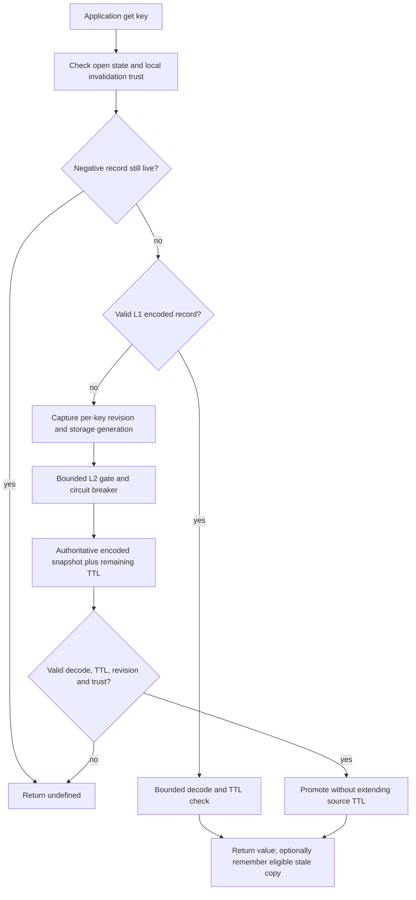
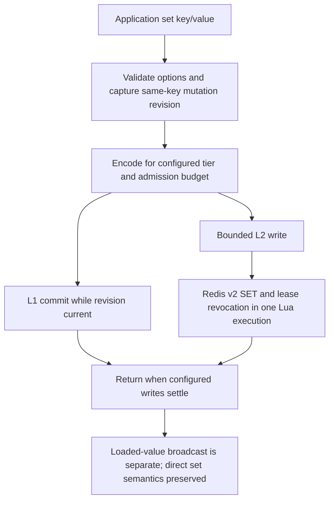
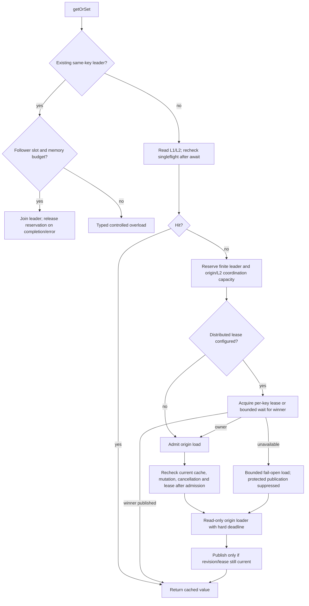
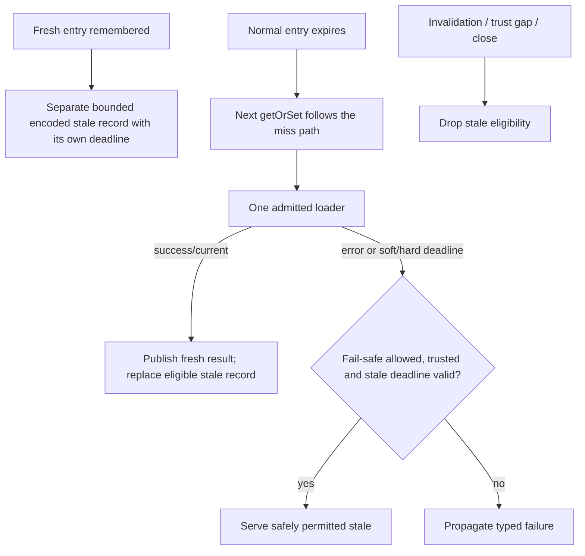
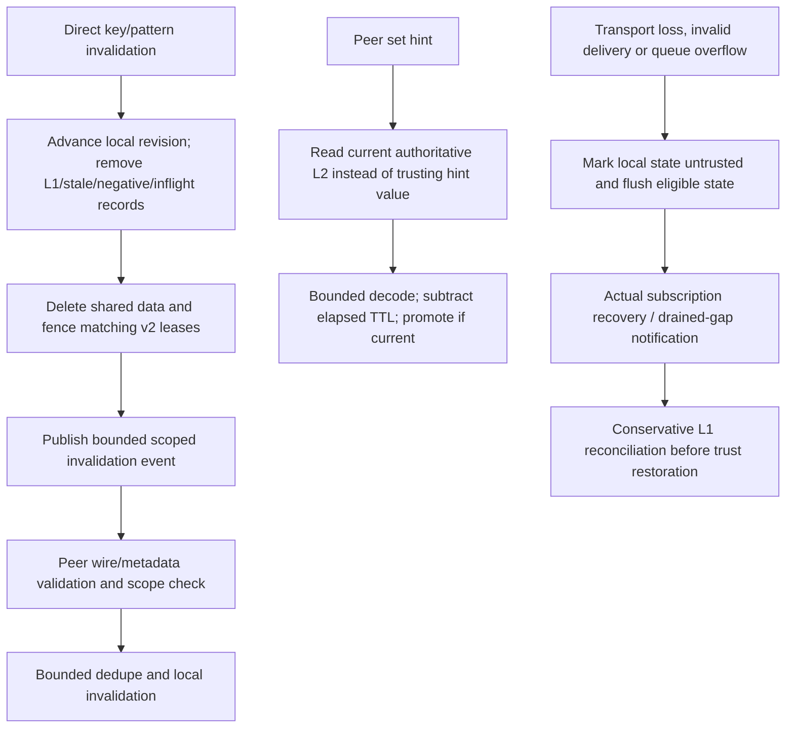
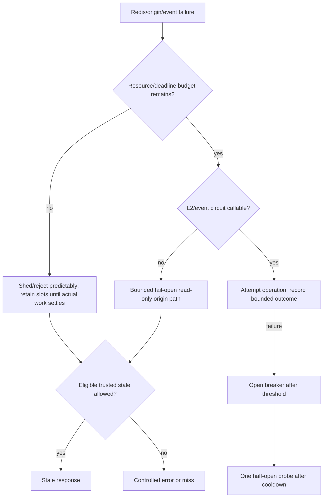
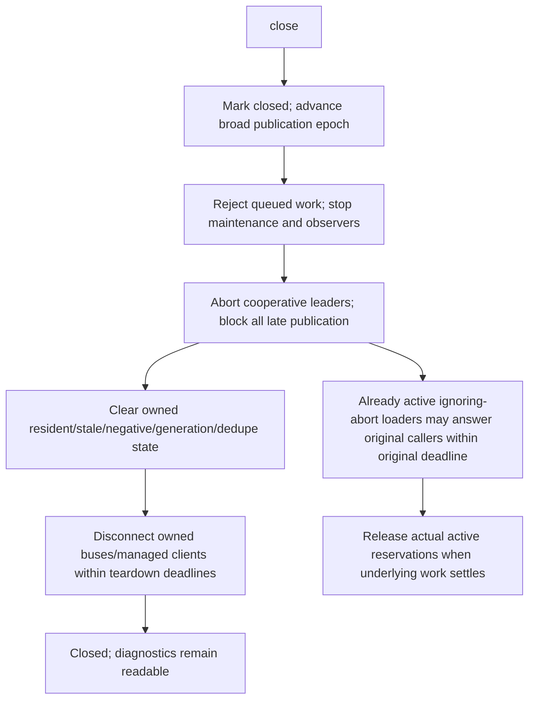
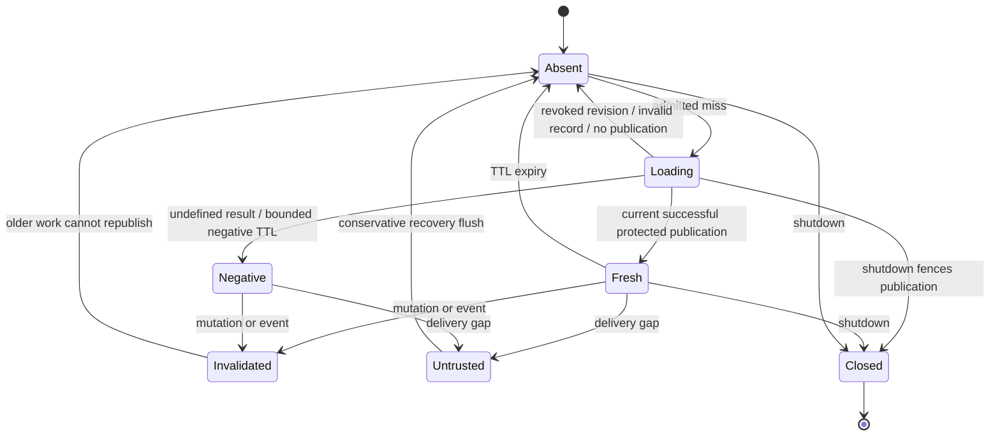

# Architecture and invariants

The implementation remains an in-process TypeScript library with optional Redis/KV and event transports. This audit retains that deployment model. The diagrams describe final intended and regression-tested transitions; adapter/topology limitations are explicit in the correctness/readiness reports.

## Read

`get` preserves read-only lookup semantics; it does not independently start a loader. A valid serialized `null` is a hit. Corrupt/unsupported/oversize records are internal misses.

## Write

Independent keys do not invalidate each other's ordinary fills. A same-key mutation or a broad invalidation invalidates older guards.

## Miss and singleflight

A timed-out caller does not release an origin or network slot while the underlying work is still running. A request cannot bypass observed lock contention simply because a waiter deadline expired, except under the explicitly configured weaker `onTimeout:'load'` policy; even that path cannot publish to protected v2 state without ownership.

## Refresh and stale fallback

There is no new background refresh service, probabilistic early refresh, priority scheduler or source-authority policy introduced by this change. Stale authorization data is unsafe unless the application explicitly permits it. Optional refresh techniques are research decisions/backlog, not benchmarked production capabilities.

## Invalidation and recovery

Ordinary Pub/Sub is not durable. Reconciliation after an observed subscriber gap does not solve an event lost only at the publisher, asynchronous Redis failover or a globally ordered source update protocol. Pattern deletion remains bounded batched enumeration, not an atomic namespace snapshot.

## Failure

## Shutdown

Closing does not falsely report zero retained active work while an ignoring-abort origin/client still owns it. Caller-provided client ownership is respected. New cache operations reject after terminal closure; old active success responses retain their compatibility contract and cannot repopulate closed state.

## Entry state model

The tests cover scheduled race transitions and seeded wildcard semantics. This is a small state model, not a formal model-checking proof of Redis failover or arbitrary custom asynchronous adapter correctness.

