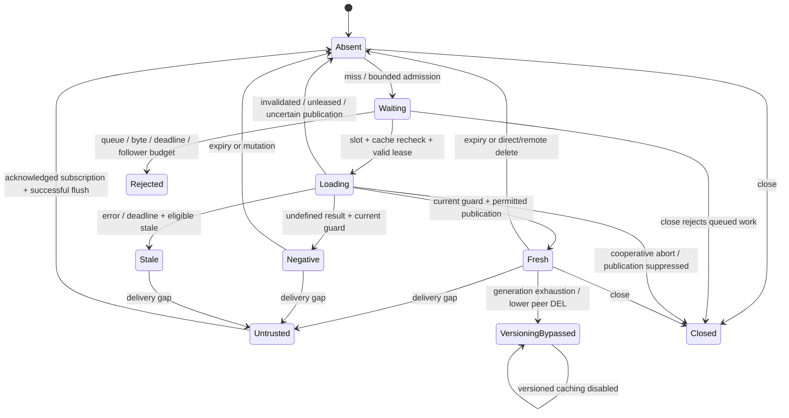

# Distributed correctness audit

Baseline: `ca9c02a04349a89278cd81b5b25d0000503cc5a3`, package 0.6.2. Comparison build: `/private/tmp/lazy-layers-ca9c02a-audit/dist/index.js`. The final full isolated live-service suite passed **480/480 tests, zero failures/skips, 22,457.34 ms**: [raw log](raw/after-docker-test.log). Build, typecheck and package checks also passed. Frozen final source digest: `e451d7c9d3524779584211fe0571acff4e68cecbf1e32e6f8bb10f8face8fd08`; built tree: `21ed478360f76848bfb2b79594169f80bda2b24fe0bf4f9caacbb9aa66608b95` ([manifest](raw/build-manifest.json)). This is evidence for the tested configuration, not production certification.

## Invariants and state machine

1. Accepted same-key followers share one local leader's result/error; leader, follower and origin execution budgets are distinct.
2. A former owner cannot overwrite protected cache state after lease expiry/takeover. Ownership-safe unlock alone is insufficient.
3. Same-key mutations supersede older local fills/promotions. Ordinary unrelated fills do not invalidate each other.
4. Expired, invalidated, untrusted or closed local state cannot be restored by older asynchronous completion.
5. A detected delivery gap requires reconciliation before L1, negative and safely stale data become trusted.
6. Propagation preserves namespace/key identity; a supplied SET payload is not authoritative version proof when shared L2 exists.



Versioned bypass is permanent until cache recreation. A running loader ignoring close may resolve existing callers; it cannot populate cache-owned state. Worker borrowed L1 remains owned by its caller.

## Findings, changes and regression evidence

| ID | Priority | Baseline issue | Response / remaining boundary |
| --- | --- | --- | --- |
| D01 | P0 | Pattern invalidation missed a cold key with only a live lease. | v2 scans matching leases too, atomically deletes/fences each data/lease pair. Tests cover old publication after invalidation. Whole-pattern SCAN is still non-atomic. |
| D02 | P0 | Equal-delete-generation late SET events blindly installed old peer payloads. | Shared-L2 priming reads current authoritative scoped L2, checks same-key guard and evicts missing/error snapshots. L1-only priming lacks a global source order. |
| D03 | Capability limit | Custom/legacy owner check then ordinary asynchronous SET could commit after takeover. | Stronger publication requires explicit `atomicPublicationSupported === true`. Compatibility adapters without it are not claimed safe for this race. |
| D04 | P0/P1 | Close allowed new operations and late fills to restore state. | Terminal `CacheClosedError`, leader abort, publication epoch/map cleanup and owned-L1 close. Active ignoring-abort callers retain their result; queued callers retain the origin gate's closed error. |
| D05 | P1 | A global ordinary-write epoch let unrelated distinct-key fills suppress each other. | Refcounted per-key revisions guard ordinary reads/writes; broad epochs handle broad invalidation, gaps, saturation and close. Concurrent distinct fills now all cache. |
| D06 | P0/P1 | Origin queue lacked cancellation and a recheck after admission. | Abort-aware bounded FIFO, timer/listener cleanup, cache/lease recheck after admission. Filled queued keys and expired queued leases do not invoke origin. |
| D07–D09 | P1 | Recovery hooks were incomplete; overflow could leave trust false indefinitely; unrelated writes interfered with reconciliation. | Transport epochs/status and queue recovery hooks; independent delivery-gap revision; transport status rechecked after flush. |
| D10 | P1 | Stringified numeric events missed numeric local state. | Additive `keyTypes`, exact typed invalidation/priming. Legacy DEL evicts canonical string/numeric forms; payload priming never guesses numeric identity. |
| D11 | P0/P1 | Corrupt encoded data became cached null. | Strict internal hit/miss decode, guarded corrupt-L1 removal, corrupt-L2 miss. Legitimate null remains a hit; public permissive deserialize compatibility remains. |
| D12 | P0 | Lock outage or explicit unlocked fallback could overwrite a later protected winner with ordinary SET. | Atomic-capable L2 returns unlocked origin result to caller without L1/L2/negative/peer publication. Existing fail-open response is preserved. |
| D13 | P0/P1 | Count-only metadata retained huge keys; forgetting generations could expose `::v0` again. | Incremental byte/count/shared-B admission, no generation reset/eviction. Saturation bypasses versioned caching and suppresses pending publication. |
| D14 | P0 | Restarted peer reset delete counter to 1; existing generation-2 cache ignored a real delete. | Every accepted lower DEL evicts local typed/legacy aliases. Versioned caches also flush and permanently bypass versioned caching. Wrong scopes filtered first; old SET hints remain rejected. |
| D15 | P0 resource | Same-key follower reactions were unlimited despite bounded origin slots. | Default cache-wide `inflight.maxWaiters = 10000`, `InflightOverloadError`, fixed 160-byte estimated reservation and finally-release on success/error. |
| D16 | P0/P1 | Peer/custom-L1 promotion extended TTL; Redis fetched oversized bodies before rejection. | Subtract elapsed read/queue/encode time, cap both ordinary/encoded L1 SET including explicit L1 level TTL. v2 STRLEN-before-GET and bounded preview use one snapshot request. |
| D17 | P0/P1 | Worker restored L1 after delayed KV reads/writes, invalidation, failed fallback or close; historical generations grew indefinitely. | Active refcounted revisions, guarded local publication/fallback, matching-flight cleanup, terminal Worker error, short fallback TTL. Shared late KV writes remain non-atomic and observable in tests. |

Source: [Hybrid lifecycle](../src/cache/hybridCache.ts#L435), [miss/admission/publication](../src/cache/hybridCache.ts#L775), [generation safety](../src/cache/hybridCache.ts#L1662), [remote mutation](../src/cache/hybridCache.ts#L1914), [origin FIFO](../src/cache/originLoadGate.ts#L37), [lease maintenance](../src/cache/distributedLock.ts), [Redis bounded scripts](../src/cache/redisStore.ts#L69), [Worker facade](../src/cloudflare/index.ts#L194).

## Work and memory bounds

Node Hybrid defaults: 32 active origin executions, 1,024 queued keys, 1,000 ms queue deadline. A separate leader cap is their sum, 1,056, including distributed waiters and disabled origin execution gates. L2 separately bounds 64 active, 1,024 queued and 32 MiB queued estimates, with 250 ms queue and 2,000 ms caller deadlines.

In-flight keys, active revision-map keys, negative keys and dedupe IDs each have a 2 MiB metadata estimate ceiling. Generation metadata has 2 MiB/10,000 keys; negative/dedupe also retain count limits. Available shared B can reject earlier. Metadata charges twice UTF-8 key length plus fixed overhead; L2 operations charge retained key/pattern, payload and queue metadata. These estimates are not measured V8 retained heap.

With task variables, tracked revision metadata depends on C but is byte bounded; accepted W is capped at 10,000 by default and by shared B. Application input/pending request objects and arbitrary custom-adapter allocations remain outside a hard RSS guarantee. Per-process origin limits can expose approximately I times configured capacity across I instances. Per-tenant fairness and a cluster-global origin budget are not implemented.

Origin/L2/follower reservations remain held until actual work/result settles even after caller timeout or close. This prevents unlimited replacement work, but uncooperative loaders/clients can retain bounded capacity and delay recovery. JavaScript cannot forcibly remove accepted Promise reactions or cancel arbitrary foreign I/O.

Worker revisions release on completion, but its raw structured-clone L1 and in-flight work lack Hybrid's aggregate byte/origin/follower budgets. Direct store `getOrSet` methods also bypass Hybrid admission/coalescing. Those integration bounds remain readiness limitations.

## Lease, publication and restart

Acquisition is `SET NX PX`; owner-checked renewal/release are scripts. v2 publication checks owner and SET+PX atomically on same-tag data/lease keys. Namespace index maintenance is outside the two-key script and adds work; no fixed single-command whole-fill claim is made.

Local lease elapsed checks use `performance.now()`. Late renewal acknowledgement cannot revive an expired local lease, including wall-clock rollback plus an event-loop stall. Redis decides actual ownership at publication. Random owner tokens are **not monotonic external fencing tokens** and do not fence database side effects. Standalone tests cannot establish safety across asynchronous replication failover/partitions.

The disposable harness separates real expiry, SIGSTOP past TTL, SIGKILL mid-refresh, lease-only pattern invalidation, stopped acquisition, paused dispatched publication and Redis restart. Unknown publication responses are not blindly replayed or used to prime peers. Redis has RDB/AOF disabled: restart is not failover or durable fencing.

## Real isolated fault evidence

The canonical pair executed all **15 cases** against each frozen build: baseline **8 PASS / 7 FAIL**, final **15 PASS / 0 FAIL**, no infrastructure errors or unexecuted cases ([before](raw/chaos-before.json), [after](raw/chaos-after.json)). Both used Node 24.21.0 on Apple M5, Darwin 25.5.0, a 96 MiB standalone Redis and the same bounded loopback proxy/harness. Exact owned projects `lazy-layers-audit-cf03d38d` and `lazy-layers-audit-632e5c7d` were cleaned up.

| Case | Actual baseline observation | Actual final observation |
| --- | --- | --- |
| Lease-only pattern invalidation | Former owner published after pattern deletion. | Former owner returned `not-owner`; data stayed absent. |
| Redis stopped during acquisition | Unleased caller returned `obsolete` and overwrote protected `winner`. | Caller still returned `obsolete`; protected `winner` remained and cache read recovered. |
| Literal / nested Redis namespaces | Literal prefix did not remove its own data; plain parent clear deleted a nested tenant's record. | Own data removed; nested and foreign namespace records retained. |
| Malformed UTF-16 key identity | Distinct surrogate keys returned the second key's value. | Distinct values retained; valid Unicode control also passed. |
| Shared Pub/Sub topic / distinct scopes | Tenant B read tenant A's `tenant-a-value`. | Tenant B returned a miss; no cross-scope payload priming. |
| Shutdown of active loader | Caller result preserved; signal not aborted; protected L2 already remained absent. | Caller result preserved; signal aborted; protected L2 remained absent. |
| Corrupt / oversized / preview records | Corruption was a null hit; oversized body fetched; preview values included. | Corruption missed; oversized body rejected before transfer; preview values omitted. |

The other eight controls passed on both revisions: actual 60 ms lease expiry, an independently frozen process beyond a 120 ms lease, killed-leader takeover, paused/unknown publication with one attempt and no peer/L1 priming, empty Redis restart, acknowledged Pub/Sub gap reconciliation, bounded mock-origin overload/recovery and simulated distributed coalescing. The shutdown Redis case demonstrates newly delivered cancellation, not a newly prevented shared Redis write: its shared value was absent on both builds. Separate local lifecycle regressions establish older L1/stale restoration failures.

For an **8,199-byte** encoded record with a 1,024-byte decode ceiling, one `getEncoded` response transferred **8,222 bytes before / 29 bytes after** to the client stream, 8,193 fewer bytes. This is a protocol-size observation, not a throughput benchmark. Sampled harness RSS was 101,253,120 / 112,525,312 bytes, below its 384 MiB threshold; it is not cache retained heap.

| Single-run recovery observation | Before | After |
| --- | --- | --- |
| Killed leader → replacement response, 120 ms lease | 186.82 ms | 187.45 ms |
| Empty Redis restart → verified ping | 217.77 ms | 196.54 ms |
| Acquisition-outage restart → verified ping | 218.23 ms | 225.94 ms |
| Post-winner cache-read recovery | NOT MEASURED: protected state failed | 0.52 ms |
| Pub/Sub reconnect → verified trust and current response | 63.84 ms | 64.33 ms |
| Mock-origin release → healthy response | 0.44 ms | 0.43 ms |

These are one observation per scenario, including planned waits and local Docker/proxy timing where applicable; no statistically supported recovery improvement is claimed. The acquisition case explicitly configured **100 ms L2 breaker cooldown on both builds**. Default 30 s cooldown recovery is **NOT MEASURED**. See [complete chaos results](09-chaos-test-results.md).

## Invalidation and startup

Pub/Sub is not durable. Detected disconnect, handler failure/overflow or malformed in-scope event marks L1/negative/stale state untrusted, advances the broad epoch and flushes. Restoration requires acknowledged subscription, successful flush, unchanged delivery-gap revision and no known ongoing transport loss. Custom buses without reliable status cannot establish this contract.

Managed setup waits `ready()` before traffic; low-level event-backed caches must do likewise. A fill before readiness may cross initial reconciliation and return its origin value without publication. The five-node live fixture now awaits readiness in initialization while preserving its exactly-one-loader assertion; a separate control proves unsafe pre-ready completion stays uncached. This startup boundary is explicit rather than relying on scheduling luck.

Final [Node 20](raw/node20-docker-runtime.log) and [Node 22](raw/node22-docker-runtime.log) compatibility runs each passed 480 tests with no failures/skips, but transitive production `@nats-io/nuid` 3.0 declares Node >=22. Passing execution does not override that vendor support range: Node 20 with the current NATS dependency is an unsupported combination. Use a supported NATS runtime or track dependency compatibility separately; no dependency was rewritten to hide this qualification.

Delete generations are non-durable local counters. Lower DEL may be reordered delivery or peer restart. Every accepted lower DEL evicts; opt-in versioning additionally bypasses caching permanently. Count/byte exhaustion or transient failure to reserve shared B can cause the same bypass. Inspect `getCoordinationStats().generationTrackingSaturated`. Recreating an object does not by itself make forgotten external epochs durable; missed remote events/restart with retained old L2 generations still require reconciliation.

## KV and custom-store limits

Worker guards prevent older completion from replacing newer synchronous local publication. KV offers no conditional owner/version publication: dispatched PUT can complete after DELETE/newer PUT and overwrite shared state. Regression controls deliberately observe that old shared record while asserting newer local L1 remains intact. Later reads can still observe eventual/stale KV. Custom asynchronous L1 lacking CAS can require conservative eviction that also discards a newer entry; built-in MemoryStore's synchronous commit avoids that loss.

No total source version exists for L1-only equal-generation SET hints. Security-critical freshness, Redis failover, missed/undetected events and external effects require an authoritative source policy beyond these cache capabilities.

## Reproducible verification

The focused group contains **67** regressions/controls: [distributed races](../test/audit-distributed-regressions.test.js), [coordination boundaries](../test/audit-coordination-boundaries.test.js), [Worker lifecycle](../test/audit-worker-lifecycle.test.js). Frozen baseline: **5 pass, 62 fail, 0 skip, 1,723.37 ms**, [raw](raw/distributed-security-before-final.txt). Failure count includes repeated branches and new counter assertions; it is not 62 distinct bugs. All are green within the final **480/480** isolated live-service suite.

Independent verification checked the revised source/build digests, reproduced binary ownership controls and passed **93/93** targeted regressions with no failures/skips ([evidence](raw/independent-verification-after.json)). Protocol doubles and bounded custom checks do not establish Redis failover, long endurance or production safety.

```sh
node --max-old-space-size=192 --test --test-concurrency=1 --test-timeout=6000 test/audit-distributed-regressions.test.js test/audit-coordination-boundaries.test.js test/audit-worker-lifecycle.test.js
LAZY_LAYERS_AUDIT_ENTRY=/private/tmp/lazy-layers-ca9c02a-audit/dist/index.js node --max-old-space-size=192 --test --test-concurrency=1 --test-timeout=6000 test/audit-distributed-regressions.test.js test/audit-coordination-boundaries.test.js test/audit-worker-lifecycle.test.js
node scripts/audit-services.mjs chaos
```

Most focused tests allow 2 seconds; the finite 10,128-delete case allows 5. Deferred operations always release in cleanup. Chaos uses a unique label-validated Docker project, 6–12-second cases, 90-second harness budget, 96 MiB Redis cap, 384 MiB harness RSS threshold and at most 64 owned proxy sockets. Replication failover, partitions, physical 10/50/100-worker clusters, source-version reconciliation and long endurance remain **NOT MEASURED**. The simulated instance matrix is explicitly one process sharing a Redis connection.

An [initial port-reassignment attempt](raw/chaos-before-attempt1.json) and [before](raw/chaos-before-unconnected-bus-attempt.json)/[after](raw/chaos-after-unconnected-bus-attempt.json) duplicate-client initialization attempts are preserved and excluded from the canonical comparison. The final harness explicitly connects buses on both revisions, asserts trust restoration, records fault observations before assertions and retains genuine baseline failures as a nonzero exit.

## Transactions

The separate transaction coordinator validates immutable tenant/operation identity, uses primary-only same-slot owner/lease scripts, bounded transport and explicit unknown outcomes. Static review established no critical transaction state-machine defect. Durable business uniqueness/version checks, authorization and reconciliation remain application requirements; cache fail-open/stale serving must not authorize irreversible effects.

Source: [keys](../src/transactions/keys.ts), [scripts](../src/transactions/scripts.ts), [transport](../src/transactions/redisTransport.ts), [operation store](../src/transactions/operationStore.ts). Primary references: [Redis locks](https://redis.io/docs/latest/develop/clients/patterns/distributed-locks/), [Kleppmann fencing](https://martin.kleppmann.com/2016/02/08/how-to-do-distributed-locking.html), [Pub/Sub delivery](https://redis.io/docs/latest/develop/pubsub/), [KV consistency](https://developers.cloudflare.com/kv/concepts/how-kv-works/). See [research comparison](06-research-comparison.md) and [production gates](12-production-readiness.md).
