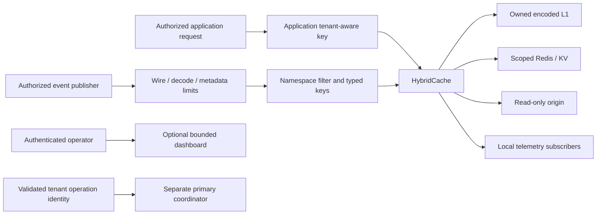

# Security and isolation audit

Baseline: `ca9c02a04349a89278cd81b5b25d0000503cc5a3` (0.6.2). Scope includes keys, event metadata, tenant boundaries, retained work, origin/L2 admission, serializers, shutdown, KV and deployment controls. Final isolated live-service suite: **480/480 pass, zero failures/skips** ([raw](raw/after-docker-test.log)); frozen source digest `e451d7c9d3524779584211fe0571acff4e68cecbf1e32e6f8bb10f8face8fd08` ([manifest](raw/build-manifest.json)). This verifies tested controls, not tenant authorization or production deployment safety.

## Trust boundaries

Generic cache keys are `string | number`, not authenticated tenant identities. The application must authorize callers and include every security-relevant scope in collision-free keys. Prefixes/events separate configured domains; they do not authorize business reads. Redis/KV stringify keys: `42` and `'42'` address the same shared record while Node local maps preserve their types. This existing alias is documented, not claimed as isolation.

## Findings and controls

| ID | Priority | Established baseline issue | Current response / qualification |
| --- | --- | --- | --- |
| S01 | P0 | Separate Redis prefixes sharing a low-level bus could expose another cache's SET payload in L1. | Managed namespace scope, optional low-level `eventNamespace`, wrong/untagged events filtered before dedupe/trust; shared-L2 priming reads current scoped L2. Unscoped L1-only shared-tenant buses remain unsafe configuration. |
| S02 | P0 | Literal glob/nested prefixes broadened destructive Redis scans. | Escape literal prefix bytes, only `*` as cache wildcard, structural full v2 data/lease validation before delete/read/index inspection. Legacy nested layout ambiguity remains. |
| S03 | P0/P1 | Historical/count-only metadata allowed huge keys outside B; forgotten generations resurrected v0. | Incremental byte/count/shared-B admission/release, active refcounted revisions, permanent versioned bypass on unsafe generation retention. |
| S04 | P1 | NaN/Infinity could defeat TTL/count/byte limits. | Central constructor/per-operation validation; Redis TTL/count/scan/batch checks before mutation; explicit zero disables applicable retention. |
| S05 | P0/P1 | Event IDs/timestamps/TTL/arrays/source/compressed messages lacked complete bounds. | Strict metadata/key-count/identifier/decode limits and bounded callback work, including raw custom buses. Other scopes cannot consume dedupe budget or make trust false. |
| S06 | P0/P1 | Numeric local invalidation failed; restarted counters suppressed real DEL. | Additive key types, conservative legacy numeric eviction, every accepted lower DEL evicts. Versioned lower DEL forces bypass; payloads never prime guessed numeric aliases. |
| S07 | P0/P1 | Legacy lock/index key collisions and overly broad internal-key exclusion. | Reserved legacy collisions reject before network; v2 admits safe `__` keys and exactly validates data/lease shapes and foreign poisoned index members. |
| S08 | P0/P1 | Corrupt bytes became valid null; oversized/compressed records exhausted resources. | Strict internal hit/miss with encoded/expanded/depth/collection limits, STRLEN-before-GET v2 snapshot and bounded preview. Valid null remains a hit. |
| S09 | P0/P1 | Closed caches restored state; Worker failed-write fallback ignored freshness. | Node/Worker terminal guards, cooperative abort, no later local publication; Worker per-key guards and requested short fallback TTL. Active responses/borrowed L1 lifetime preserved. |
| S10 | P0 resource | Followers were unlimited; queued closures retained arbitrary key/pattern bytes. | Finite follower admission/typed overload/shared-B estimate; L2/origin retained bytes charged through actual settlement. Worker/direct-store integration needs external concurrency/byte limits. |
| S11 | P2/operator | Raw telemetry/dashboard keys/errors may carry sensitive application data. | Fixed Prometheus labels, bounded observability/SSE, optional dashboard; application redaction/authentication remains necessary. |

Evidence: [focused tests](05-distributed-correctness.md#reproducible-verification), [event codec](../src/event-bus/eventCodec.ts), [Hybrid scope](../src/cache/hybridCache.ts#L192), [Redis namespace parser](../src/cache/redisStore.ts#L773), [decode policy](../src/utils/serializerPolicy.ts), [Worker facade](../src/cloudflare/index.ts#L194). Remaining lease/stale-write capabilities are explicit in [distributed correctness](05-distributed-correctness.md).

## Admission and byte bounds

Node in-flight, active revision, negative and dedupe metadata each have a 2 MiB estimate ceiling; generations have 2 MiB/10,000 keys. Shared B may reject earlier. Oversized negative/inflight metadata is skipped without replacing the origin caller's response. If a key revision cannot be safely registered, its value may return uncached but cannot satisfy guarded publication.

Default accepted follower maximum is 10,000 cache-wide with a fixed 160-byte estimate held through the shared result. Tests with a budget of three admit three and shed excess predictably, release on success/error, and preserve shutdown caller compatibility. A separately configured 100,000 simulation does not imply an unlimited default queue.

L2 charges retained key/pattern and available encoded payload before dispatch/queue; caller timeout does not release underlying retention. Origin queues charge keys and clean timers/abort listeners. These ledgers do not account exact V8 heap, allocator fragmentation, caller-owned inputs, or arbitrary unencoded custom-adapter objects. The memory report supplies measured process evidence separately.

Worker structured-clone L1 lacks an aggregate byte cap; Worker in-flight/follower/origin work lacks Hybrid admission bounds. Direct store helpers bypass Hybrid. These limits prevent an unqualified package-wide memory/overload readiness declaration.

## Decode and inspection boundaries

Built-in strict internal defaults: 25 MiB encoded, 25 MiB expanded, depth 128, 1,000,000 collection elements. Invalid records become misses while valid null retains an explicit hit flag. Public permissive deserialize preserves its existing default compatibility; callers handling untrusted raw bytes must select explicit limits.

Native v2 snapshot checks STRLEN before GET and returns a small oversize result without its body. GET/PTTL/size share one Lua request. Indexed/nonindexed preview restricts scope, page count, encoded transfer and expanded decode. Minimal custom clients/legacy fallback may still buffer whole GET before rejection; KV platform GET similarly precedes application body checks.

Managed setup forwards decode configuration to generated tiers. Independently constructed wrapper/L1 limits must match: a wrapper cannot infer a custom store's tighter policy when it consumes `getEncoded`. Decode ceilings do not provide an aggregate Redis server memory budget; configure maxmemory/admission separately.

## Namespace and migration contract

Set a stable explicit low-level tenant scope when topics/buses are shared. New scoped receivers reject untagged old-peer messages. Publish scope-aware events across the deployment, drain/reconcile old entries, and account for the mixed-version interval where old peers cannot invalidate new scoped peers. Caller topic/prefix overrides remain part of deployment correctness.

Valid Unicode v2 keys preserve their existing wire layout. Distinct malformed UTF-16 inputs use distinct fallback tag text, retaining distinct **full physical data/lease identities** through UTF-8 replacement. This is not collision-free Redis slot hashing: Redis has 16,384 slots and different keys/tags can share a slot. Same-tag data/lease colocating is deliberate.

Legacy reserved lock/index logical keys now reject; arbitrary nested prefixes cannot be proved disjoint in that layout. Use coordinated v2 cache-cold migration/reconciliation. Worker/KV concatenated prefix/key identities also require collision-free application design, and KV remains eventually consistent without conditional publication.

Lower accepted DEL may be reordered delivery or a restarted peer's current mutation. Unversioned caches evict; versioned caches also permanently bypass until recreation. Generation count/bytes/transient shared-B pressure can cause the same bypass. Observe saturation rather than reset it solely for hit ratio while old external versions remain reachable.

## Freshness and external effects

Stale-if-error is enabled for ordinary availability. Disable it where stale revocation/authorization/isolation state is unacceptable. No total source-version order is established for L1-only SET hints, missed undetected events, eventual KV or Redis failover. Authoritative reads/source version validation remain necessary for stronger application consistency.

Keep origin loaders read-only. Cache-resource owner fencing does not fence payments, database writes or external side effects. The separate transaction API validates operation identity and primary coordination, but business authorization, durable uniqueness and reconciliation belong to the application.

## Deployment controls

- Authenticate Redis, scope ACL keys/channels, use TLS as appropriate, isolate networks, bound server memory, and use authoritative primary coordination. Custom clients can enable buffering/replay; managed defaults disable them.
- Observe integration-specific runtime support: Node 20 passed the test suite, but current transitive NATS `@nats-io/nuid` 3.0 declares Node >=22. That tested behavior is not vendor-supported Node 20 NATS deployment.
- Bounded snapshot Lua requires STRLEN, GET and PTTL plus scripting permission. [Discovery](../src/cache/redisCapabilities.ts) now includes STRLEN and publishes the contract. COMMAND INFO availability does not prove current-user ACL permission.
- Keep optional dashboard access private with deployment-specific authentication. Development credentials and raw-key/error telemetry do not redact application secrets; query tokens can enter access logs.
- Bound application/Worker concurrency and payload admission too. Library ledgers cannot limit values already allocated by callers.

## Evidence and limits

Frozen focused group: **67 tests, 5 pass, 62 fail, zero skips**, [raw](raw/distributed-security-before-final.txt). Failures represent multiple branches/counter assertions, not 62 unique vulnerabilities. Final group is green within **480/480** live tests. Production gates retain separate capability/resource limits despite passing tests.

Fault tests use exact Docker project/service/disposable labels, verified loopback mappings, 96 MiB Redis cap, stable owned proxy with at most 64 sockets, case/total deadlines, and socket/unpause/start/Compose cleanup. The first attempt correctly aborted when Docker reassigned an ephemeral port; [attempt1](raw/chaos-before-attempt1.json) is infrastructure evidence excluded from library comparisons. Final case data belongs in [chaos results](09-chaos-test-results.md).

The canonical isolated pair executed **15/15 cases on each revision** without infrastructure errors: [baseline](raw/chaos-before.json) **8 PASS / 7 FAIL**, [final](raw/chaos-after.json) **15 PASS / 0 FAIL**. Real Redis reproduced cross-tenant exposure on a shared Pub/Sub topic (`tenant-a-value` visible to tenant B), plain-parent invalidation deleting a nested namespace, literal-prefix invalidation retaining its own data, malformed-key aliasing and an unlocked outage fallback overwriting a protected winner. Those final cases preserve scope/key identity and protected state. The final shutdown case delivers abort while preserving the existing caller result; protected Redis state was already absent in the baseline case.

An 8,199-byte encoded value with a 1,024-byte configured ceiling transferred **8,222 bytes before / 29 bytes after** for one client `getEncoded` response. Corrupt bytes changed from `NULL_HIT` to `MISS`; bounded inspection omitted all record values in the scenario. These are measured wire/correctness observations, not broad throughput or RSS guarantees. Both canonical revisions explicitly connect buses, verify restored trust and use a 100 ms L2 breaker cooldown in the acquisition fault; default cooldown recovery is not measured. Unconnected-client attempts are retained separately ([before](raw/chaos-before-unconnected-bus-attempt.json), [after](raw/chaos-after-unconnected-bus-attempt.json)).

No complete tenant authorization, durable invalidation, external monotonic fencing, strict total RSS guarantee, Worker aggregate safety, physical 100-worker cluster safety or replication-failover certification is claimed. These gates remain visible alongside corrected races and measured performance.
