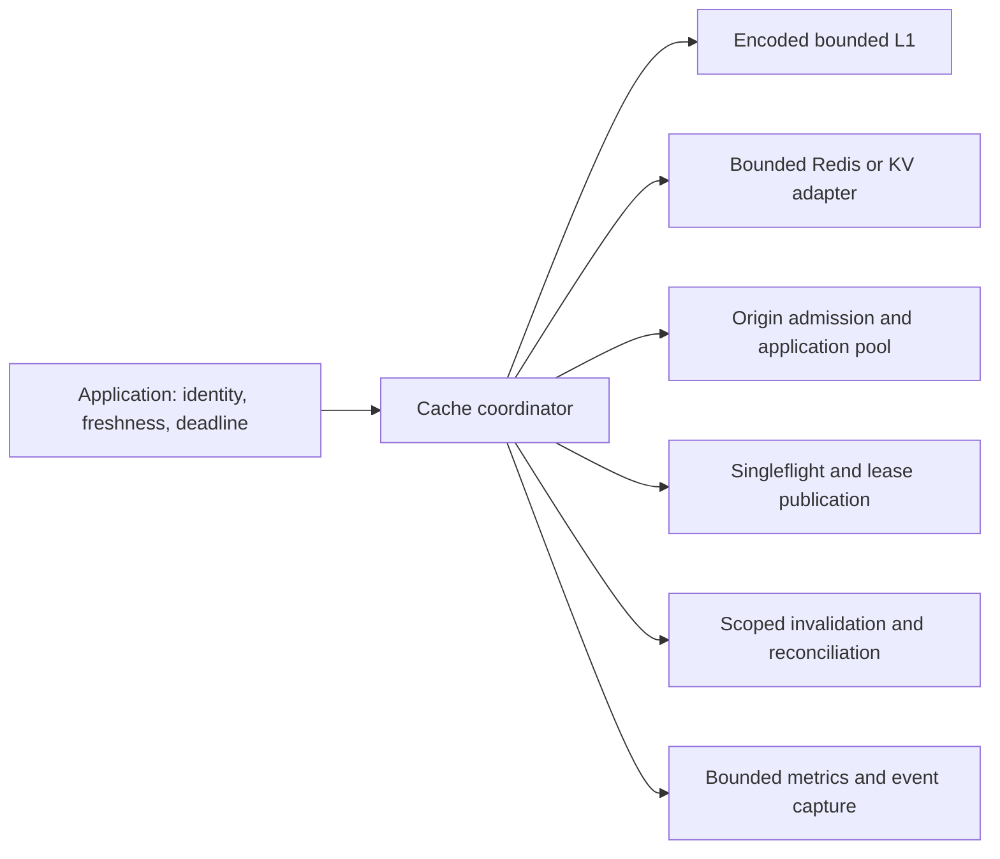

# Architecture decisions and prioritized backlog

Keep one library with deep, testable modules. The Node coordinator already separates encoded L1, L2 transport, leases, origin admission, event delivery, and observability. The measured changes repair those boundaries without introducing a gateway, routing service, or a new default eviction algorithm.

## Target boundaries

| Layer | Current contract | Next justified improvement |
| --- | --- | --- |
| Access | Generic keys; managed namespace and event scope | Application-owned authenticated tenant identity and deadline propagation. Do not infer authorization from key text. |
| L1 | Encoded LRU; finite entry/admission ledger; per-key TTL lookup | Profile high-water engine capacity and V-dependent defensive/stale copies before adding reuse. Keep straightforward LRU as the default. |
| L2 | Reused Redis client; bounded command gate and encoded snapshot | Verify v2 scripts/ACLs against provisioned Cluster and failover topologies; optional batching only after measuring independent-key traffic. |
| Coordination | Bounded singleflight, per-key revisions, atomic owner publication | Source-version validation where Redis-primary leases cannot satisfy the consistency contract. Monotonic fencing must be enforced by the destination. |
| Origin | Per-cache active/queued/follower caps and timeouts | Shared application pool limits and tenant fairness; optional adaptive limits only with latency/recovery evidence. |
| Consistency | Scoped events, authoritative peer snapshots, observed-gap recovery | Durable outbox/source version or reconciliation for undelivered invalidations. No claim that Pub/Sub is durable. |
| Observability | Fixed metric categories; bounded wire queues, ring snapshots, SSE | Application redaction, authenticated dashboards, and operational budgets for client/native/caller memory. |
| Worker facade | Portable bounded decoding and local lifecycle guards | Separately design shared-isolate byte/origin/follower limits. KV's lack of conditional publication needs a documented weaker contract or an authoritative coordinator. |

`ready()` is the subscription acknowledgement boundary for deterministic initialized-cluster stampede assertions. Calls admitted during subscription startup still degrade safely; recovery can invalidate their publication guard and cause another origin load. This is preferable to publishing a result across an unobserved invalidation interval, and it must remain visible in startup metrics.

## Decisions based on evidence

- Keep the existing frequency/byte admission default. The paired trace matrix shows workload-dependent hit and byte-hit trade-offs. It does not establish a universal TinyLFU win. The paper and implementation comparison is in [research](06-research-comparison.md).
- Keep consistent-hash routing outside the default library. Local singleflight plus per-key Redis leases already coalesce the measured hot-key storm. Affinity can reduce Redis followers, but can also concentrate hot keys, depend on membership, and rebalance on failure/scaling. No measured architecture comparison justifies another service.
- Keep compression optional and tagged. Compare actual codec selection, entropy, CPU and wire size rather than claiming that maximum compression ratio minimizes total cost. JSON is unsuitable for preserving all native value types; current MessagePack Map limitations remain documented.
- Retain strict decoding, owned buffers and stale-publication guards even when they cost warm-cache CPU. Performance evidence cannot waive an isolation or data-correctness gate.
- Do not replace the bounded L2/origin FIFO implementation merely because its dequeue can be linear in the configured queue size. Its count is bounded; a different queue needs a measured contention/latency result and equivalent cancellation behavior.

## Prioritized backlog

| Priority | Work | Acceptance evidence |
| --- | --- | --- |
| P0 | Define and implement the Worker facade resource/consistency contract | Byte-bounded large-value admission, finite active leaders/followers/queues, TTL/error/close regressions; KV out-of-order writes explicitly tested. |
| P0 | Strict source freshness and lost-invalidation recovery | Durable source version/outbox or reconciliation; delayed/lost/reordered events, restarts and version conflicts against the actual deployment. |
| P0 | Redis failover/Cluster lease guarantees | Isolated replica/Cluster topology, paused leader, former owner, failover during publication, unknown outcomes and ACL restrictions; no old protected overwrite. |
| P0 | Application tenant origin fairness and authorization freshness | Fair shared pool/admission under one abusive tenant; cache scope does not substitute for authentication. |
| P1 | Hours-long memory and overload recovery endurance | Stable bounded workloads, actual container RSS/GC/native fragmentation and client buffering, repeated outages; hard resource budgets and automatic teardown. |
| P1 | Async custom-L1 conditional publication capability | Atomic compare/commit tests preserving newer data during delayed old writes; otherwise conservative eviction stays documented. |
| P1 | Resolve Node 20 declared dependency support | Supported runtime matrix for NATS transitive dependencies and dev-only Wrangler tooling; live tests and package verification do not override upstream engine declarations. |
| P1 | Reduce repeated stale/encoded copies if profiling supports it | Before/after 64 B–10 MiB workloads, heap ownership and invalidation/TTL tests, with end-to-end tail latency. |
| P1 | Wider origin recovery/refresh scheduling measurements | Optional refresh shedding, deadline/cancellation propagation, bounded retry jitter, recovered-origin herd; tenant-safe stale policy. |
| P2 | CLOCK/segmented LRU/W-TinyLFU prototypes | Uniform, Zipf, scan, burst, shift and heterogeneous traces; object/byte hit ratio, CPU, metadata, tails; keep only a reproducible practical win. |
| P2 | Batch reads/writes and alternate compression thresholds | Actual Redis command/network counts, entropy-aware codec CPU/memory, no change to stored-value decoding semantics. |
| P3 | Optional affinity/power-of-two-choices/adaptive concurrency | Independent load generator, physical membership changes, imbalance and hot-worker tails; infrastructure cost justified by origin/Redis savings. |

Deployment/rollback and compatibility changes are in [migration notes](migration.md). Final executed release gates are in [production readiness](12-production-readiness.md). This backlog does not certify unfinished work.
