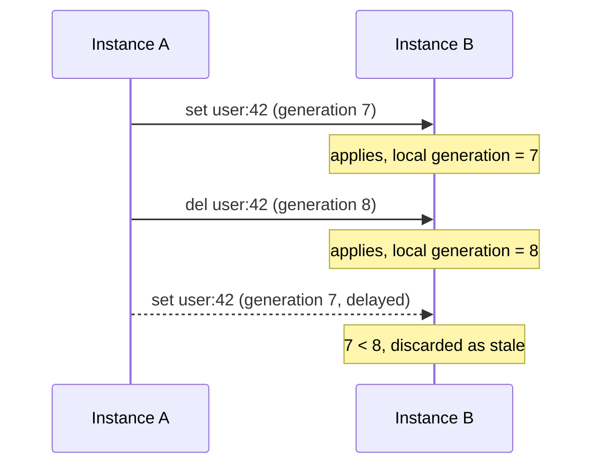

Message buses redeliver, reorder and duplicate. A distributed cache that applies every event it receives, in the order it receives them, will eventually put back a value somebody deleted.

Three mechanisms prevent that. They run in order on every inbound event.

## 1. Deduplicate by event ID

Every published event carries an ID. Each instance remembers the IDs it has recently applied, and an event whose ID it has already seen is discarded with an `invalidation:duplicate` event.

Durable transports redeliver by design, so this is what stops a redelivery being applied twice.

The memory is bounded by two options:

| Option | Default | Purpose |
| --- | --- | --- |
| `eventDedupeMaxEntries` | `10000` | How many recent IDs to remember |
| `eventDedupeTtlMs` | `300000` | How long each ID is remembered |

Set the TTL comfortably above your worst-case redelivery window. If an event is redelivered after its ID has been forgotten, it will be applied a second time.

## 2. Filter your own events

Every event carries the `source` of the instance that published it. An instance ignores events matching its own source, because it already applied that change locally when it made it.

This is why `source` should be stable and distinct per instance. Two instances sharing a source will ignore each other's events, and the bus will appear to do nothing.

## 3. Compare per-key generations

The mechanism that actually handles ordering.

Each instance keeps a generation counter per key, incremented whenever it applies a change. `del` and `set` events carry the generation they were published at, and an inbound event whose generation is older than the one already applied is discarded, emitting `invalidation:stale`.



Without this, the delayed `set` would repopulate a key that a newer `delete` removed, and the value would stay wrong until its TTL expired.

## What is not guaranteed

<Warning>
These mechanisms make invalidation safe against reordering and redelivery. They do not make the cache linearizable.
</Warning>

Specifically:

- **Delivery is not guaranteed** on at-most-once transports. An instance that was disconnected misses events entirely, and falls back to TTL expiry.
- **There is no global order.** Generations are per key. Two different keys can be applied in either order on different instances.
- **There is a propagation window.** Between a write and its event arriving, peers serve the old value. The window is one network hop rather than a TTL, but it is not zero.
- **A partitioned instance drifts.** It keeps serving its own L1 until it reconnects or entries expire.

If you need a key never to be served stale, do not cache it, or give it a TTL short enough that the worst case is acceptable.

## Watching it work

```ts
cache.on((event) => {
  if (event.type === 'invalidation:stale') {
    logger.debug({
      key: event.key,
      incoming: event.generation,
      local: event.localGeneration,
    }, 'discarded stale invalidation');
  }
  if (event.type === 'invalidation:duplicate') {
    metrics.increment('cache.invalidation.duplicate');
  }
});
```

A steady stream of `invalidation:duplicate` on a durable transport is normal. A steady stream of `invalidation:stale` suggests events are arriving badly out of order, which is worth understanding before it causes something else.
