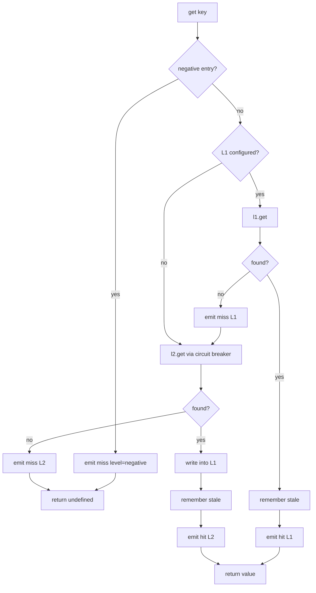
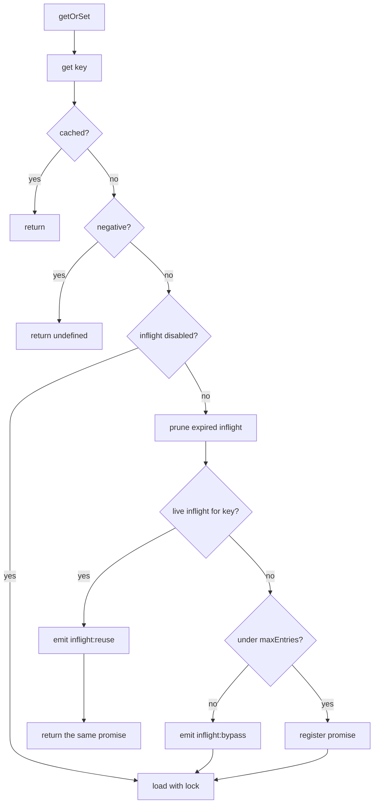

Three paths do most of the work. This page traces each one as it is implemented in `src/cache/hybridCache.ts`.

## Read: get

Two details worth noting.

The negative check comes first, before any layer is touched. A key recorded as a known miss costs nothing.

The promotion on an L2 hit is what makes the second read cheap. The value is written into L1 before being returned, so the next read on that instance never leaves the process.

Every L2 call goes through the circuit breaker wrapper. A failure is converted to the fallback value, which for `get` is `undefined`, so an L2 error becomes a miss rather than an exception.

## Load: getOrSet

The registered promise removes itself from the inflight map when it settles, whether it resolved or threw. A failed load does not leave a poisoned entry behind that later callers would join.

## Load with the distributed lock

Only when `distributedLock.enabled` is true and the L2 supports locking.

<Steps>
<Step title="Try to acquire">
A random token is generated and `acquireLock(key, token, ttlMs)` is called through the circuit breaker. A failure returns `false` rather than throwing, so a broken Redis degrades to unlocked loading.
</Step>
<Step title="If acquired, load">
The loader runs, and the lock is released in a `finally` block so a throwing loader still releases it.
</Step>
<Step title="If not acquired, poll">
Sleep `pollMs`, then call `get(key)`. Repeat until the value appears or `waitTimeoutMs` elapses.
</Step>
<Step title="On timeout, load anyway">
Rather than fail, the waiting instance runs the loader itself. A dead lock holder cannot block the cluster for the full lock TTL.
</Step>
</Steps>

## Loader execution and timeouts

The loader is called with an `AbortController` signal. Which timeout applies depends on configuration:

| Condition | Behaviour |
| --- | --- |
| `softMs` set, fail-safe on, stale value available | Race against `softMs`. On timeout, abort, emit `loader:timeout`, throw `LoaderTimeoutError('soft-timeout')` |
| `hardMs` set | Race against `hardMs`. On timeout, abort, emit `loader:timeout`, throw `LoaderTimeoutError('hard-timeout')` |
| Neither | Await the loader with no timeout |

The soft path is only taken when a stale value exists to fall back to. Timing out without an answer to serve would be strictly worse than waiting.

The `LoaderTimeoutError` is caught upstream, where fail-safe converts it into a `stale:hit`.

## Write: set

A write fans out to every configured layer, then to the bus if one is attached. The L2 write is serialized; the L1 write stores the live object.
