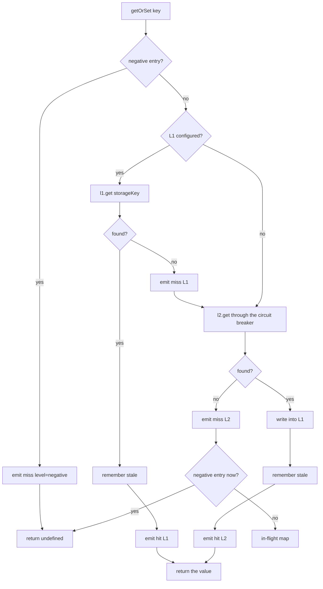
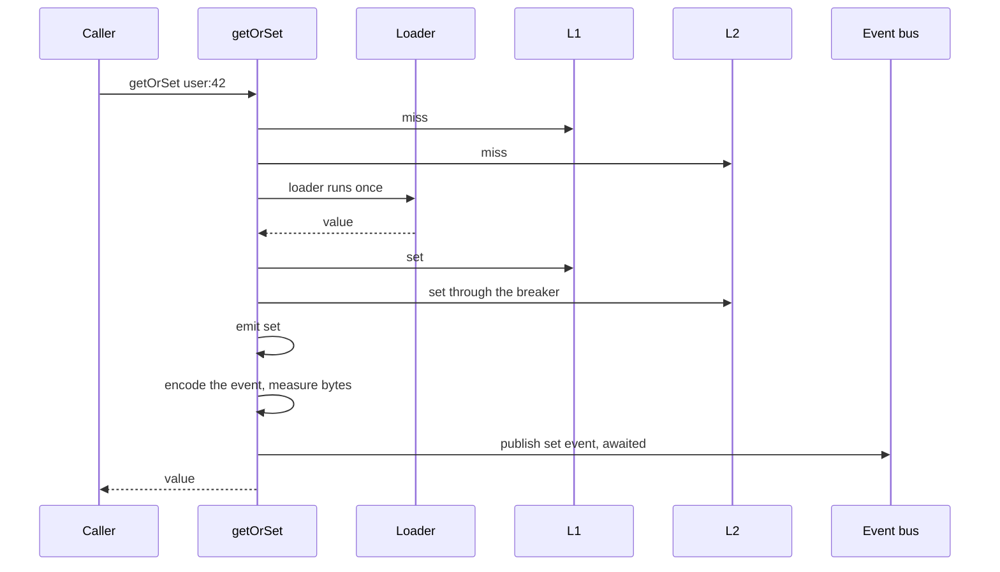

Three paths do all the work. This page traces each one step by step, in the order the code actually runs them, because the ordering is where the surprises live.

If you read only three things here, read [where the in-flight promise is registered](#where-the-in-flight-promise-is-registered), [where the bus publish happens](#the-broadcast-happens-after-the-local-write), and [when the generation counter moves](#invalidation). Each of those is an ordering people assume incorrectly, and each one changes what your system does under load.

## The read path

`getOrSet` is the whole read. It resolves a value from the cheapest place that has it, and only reaches your loader when nothing does.



Step by step:

<Steps>

<Step title="Check the negative cache">
Before any layer is touched. A key recorded as a known miss emits `miss` with level `negative` and returns `undefined` immediately, with no L1 lookup and no L2 round trip. A remembered miss is the cheapest possible read.
</Step>

<Step title="Resolve the storage key">
Normally this is your key unchanged. With `versioning.enabled` set to `true`, the key's current generation counter is appended, so `user:42` becomes `user:42::v3`.
</Step>

<Step title="Read L1">
A hit remembers the value as stale, emits `hit` with level `L1`, and returns. Nothing leaves the process. A miss emits `miss` with level `L1` and falls through.
</Step>

<Step title="Read L2 through the circuit breaker">
Every L2 call goes through the same wrapper. If the breaker is open the call is skipped and `l2:skipped` is emitted. If the call rejects, `l2:error` is emitted and the failure is converted to the fallback value, which for a read is `undefined`. Either way an unhealthy L2 becomes a miss rather than an exception.
</Step>

<Step title="Promote an L2 hit into L1">
On a hit the value is written into L1 **before** being returned, then remembered as stale, then `hit` with level `L2` is emitted. That promotion is what makes the second read of the key on this server free.
</Step>

<Step title="Re-check the negative cache">
The L2 round trip is a window, and a concurrent loader on this server can record a negative entry inside it. So the check runs again after the read returns nothing, and a negative entry found here returns `undefined` without reaching the in-flight map.
</Step>

</Steps>

### Where the in-flight promise is registered

**After the L2 read, not before.** This is the ordering that matters most, and the one worth being precise about.

The in-flight map is consulted only once the read above has fully completed and returned nothing. It is not consulted at the top of `getOrSet`, and it is not consulted before the L2 round trip.

The consequence is exact: **in-flight dedupe collapses loader calls, not L2 reads.** Ten thousand concurrent callers for one cold key each perform their own L1 lookup and their own L2 round trip. Then all but one of them find the in-flight entry and join it.

<Note>
  `benchmarks/herd.mjs` fires 10,000 concurrent `getOrSet` calls at a single cold key and counts loader calls. With dedupe on, the default, that is 1 loader call and 9,999 in-flight reuses. With dedupe off it is 10,000 loader calls. Both runs assert every caller received the correct value, so the collapse cannot come from dropping requests.
</Note>

Once the read has returned nothing, the sequence is:

<Steps>

<Step title="Honour an explicit opt out">
If `inflight.enabled` is `false`, either on the call or on the cache, the load runs immediately and no entry is registered.
</Step>

<Step title="Prune expired entries">
The whole map is swept and entries past their `expiresAt` are removed. An in-flight entry expires after `inflight.ttlMs`, which defaults to 5,000 ms, so one wedged loader cannot pin every future caller behind it forever.
</Step>

<Step title="Join a live entry if there is one">
A live promise for the key means `inflight:reuse` is emitted and that same promise is returned. The loader is not called. This is where 9,999 of the 10,000 callers end up.
</Step>

<Step title="Check the tracking cap">
`inflight.maxEntries` bounds how many keys can be tracked at once. When the map is full, the new key emits `inflight:bypass` with `reason: 'maxEntries'` and loads directly, without being registered. Leave the option unset for an unbounded map.
</Step>

<Step title="Register, then return">
The load is started, a `.finally` handler that removes the key from the map is attached to it, and the resulting promise is stored under the key with an `expiresAt`. There is no `await` between the lookup in step three and this registration, so the two run in one uninterrupted turn and two callers cannot both register the same key.
</Step>

</Steps>

The removal handler runs on both settlement paths, so a load that throws leaves no poisoned entry behind for later callers to join.

## Load and store

Everything below happens inside the promise that was just registered.

<Steps>

<Step title="Start the clock and the AbortController">
A fresh `AbortController` is created per load, and `loader:start` is emitted.
</Step>

<Step title="Call the loader">
Your loader is invoked with `{ signal }` **once**, immediately, before any timeout race is set up. Which race it is then entered into depends on configuration, but the call itself has already happened and does not vary.
</Step>

<Step title="Race it, if a timeout applies">
`softMs` applies only when all three of fail-safe enabled, a `softMs` value, and a stale value for this key are true together. Otherwise `hardMs` applies if it is set. Otherwise the loader is awaited with no ceiling. On a timeout the signal is aborted, `loader:timeout` is emitted, and a timeout error is thrown into the next step.
</Step>

<Step title="Handle a failure">
Any throw, from your loader or from a timeout, emits `loader:error` with the elapsed duration. If a stale value exists **and** fail-safe is enabled, `stale:hit` is emitted with a reason of `loader-error`, `soft-timeout` or `hard-timeout`, and the stale value is returned. Otherwise the error is rethrown and reaches your caller.
</Step>

<Step title="Handle undefined">
`loader:success` is emitted first. Then, if the value is `undefined`, a negative entry is recorded, and a stale value is returned in its place when fail-safe is enabled. **Nothing is written to either layer and nothing is published.** An absent value is not a cache write.
</Step>

<Step title="Write locally, awaited">
L1 first, then L2 through the circuit breaker, then remember the value as stale, then clear any negative entry for the key, then emit `set` with the levels that are active. Both layer writes are awaited before the next step begins.
</Step>

<Step title="Broadcast">
Only now, and only when a bus is configured and `broadcastSet` is not `false`.
</Step>

</Steps>

### The broadcast happens after the local write

The local write is fully awaited before the broadcast block is entered, and the publish itself is awaited too. Your `getOrSet` caller is still waiting while the event goes out.



The broadcast itself is three steps:

<Steps>

<Step title="Build the event">
A `set` event carrying a fresh ID, the key, the loaded value itself, the effective `ttlMs`, this server's `source`, a timestamp, and the key's current generation counter. A `set` does not advance that counter.
</Step>

<Step title="Measure it">
The entire event is encoded with the normal serializer and its byte length is measured. If `broadcastSetMaxBytes` is set and the encoded event exceeds it, `set:broadcast-skipped` is emitted with `reason: 'max-bytes'`, `bytes` and `maxBytes`, and nothing is published. The local write stands and peers read the value from L2 when they need it.
</Step>

<Step title="Publish it">
Otherwise `set:broadcast` is emitted and the event is published. If the bus circuit breaker is open, the publish is skipped with `event-bus:publish-skipped` and the event is dropped, not queued. If the publish rejects, `event-bus:publish-error` is emitted and the rejection is swallowed. Neither outcome fails the read.
</Step>

</Steps>

<Warning>
  `broadcastSetMaxBytes` has no default. Without it, a 5 MB value is encoded and sent in full to every server on the bus. Pick the ceiling from what your bus and your servers can absorb, not from what your largest value happens to be, because a broadcast is sent once and received by everyone.
</Warning>

## Load with the distributed lock

This sits between the in-flight registration and the load above, and only when `distributedLock.enabled` is `true` **and** the L2 supports locking. Otherwise the load runs directly.

<Steps>

<Step title="Try to acquire">
A random token is generated and the lock is acquired through the circuit breaker with a fallback of `false`, so a broken Redis degrades to unlocked loading rather than throwing. The lock TTL defaults to 10,000 ms.
</Step>

<Step title="If acquired, load">
The load runs, and the lock is released in a `finally` block, so a loader that throws still releases it.
</Step>

<Step title="If not acquired, poll">
Sleep `pollMs`, which defaults to 50, then re-run the read path from the top. Repeat until a value appears or `waitTimeoutMs` elapses, which defaults to 2,000. The poll re-reads the cache, it does not call your loader.
</Step>

<Step title="On timeout, load anyway">
Rather than fail, the waiting server runs the loader itself. A dead lock holder cannot block the cluster for the full lock TTL.
</Step>

</Steps>

## Write

A write touches five things and, on its own, tells nobody.

<Steps>
<Step title="Resolve the storage key">Appending the generation when versioning is on.</Step>
<Step title="Write L1">Awaited. The live object is stored as it is, with no encoding.</Step>
<Step title="Write L2 through the circuit breaker">Awaited. The value is serialized here. A failure emits `l2:error` and is swallowed, so the L1 write stands alone.</Step>
<Step title="Remember it as stale">Only when fail-safe is enabled and `staleTtlMs` is positive.</Step>
<Step title="Clear the negative entry and emit">Any recorded miss for this key is dropped, then `set` is emitted with the active levels.</Step>
</Steps>

That is the whole write. It is what step six of the load above runs, and the broadcast that follows it there is a separate step performed by `getOrSet`, not by the write itself.

<Warning>
  A direct `cache.set()` runs exactly those five steps and stops. It never publishes to the bus, and it never advances a generation counter. Peers learn about the value only when they read L2 themselves, or when a later invalidation reaches them. If you want the fan-out, the write has to come from a `getOrSet` loader.
</Warning>

## Invalidation

`delete` is local first, published second, and the order inside the local part is what makes the published event correct.

<Steps>

<Step title="Drop the in-flight promise, the negative entry and the stale copy">
All three, before any layer is touched. Dropping the in-flight promise is what stops a load that is already running from writing the value back after the delete.
</Step>

<Step title="Resolve the storage key, then advance the generation">
In that order. The key is captured at its current version, and only then is the counter incremented by one. With versioning on, that is what makes the delete remove the pre-delete key rather than a version that was never written.
</Step>

<Step title="Delete from L1, then L2">
Both awaited, with the L2 delete going through the circuit breaker like every other L2 call.
</Step>

<Step title="Emit delete, then publish">
The published `del` event carries the generation read **after** the increment, so peers receive the new number and any older event still in flight loses the comparison against it.
</Step>

</Steps>

`deleteByPattern` follows the same shape with two differences: the in-flight, negative and stale maps are swept for matching keys rather than one key being removed, and the published `pattern` event carries **no generation at all**. Pattern invalidations have no ordering protection. `clear()` is `deleteByPattern('*')`.

<Warning>
  `deleteByPattern('*')` scans your entire keyspace on every server. Prefix patterns tightly, and never build one from user input.
</Warning>

On the receiving side, after an event has passed the three [ordering checks](/docs/architecture/event-ordering):

| Inbound event | What the peer does |
| --- | --- |
| `del` | Raises the local counter to the maximum of local and incoming, then runs the same local delete across L1, L2, negative, stale and in-flight |
| `set` | Raises the counter to the maximum, then writes the value into **L1 only**, remembers it as stale, clears the negative entry and the in-flight promise, and emits `set:received` |
| `pattern` | Runs the local pattern delete immediately, with no generation check |

A remote `set` never writes L2. The shared copy comes from the publishing server's own write.

## Watching the order

The event stream is emitted in execution order, so subscribing to it is the cheapest way to confirm any of the above against your own configuration.

<CodeGroup>
```js src/users/repository.js
import { cache } from '../cache/index.js'
import { db } from '../db.js'

// hit L1, or miss L1 then hit L2, or miss both then loader:start,
// loader:success, set, set:broadcast, in that order.
cache.on((event) => console.log(event.type, 'key' in event ? event.key : ''))

export async function getUser(id) {
  return cache.getOrSet(`user:${id}`, async ({ signal } = {}) => {
    const row = await db.users.findById(id, { signal })
    return row ?? undefined   // undefined records a negative entry, writes nothing
  })
}
```

```ts src/users/repository.ts
import type { CacheEvent } from 'lazy-layers-cache'
import { cache } from '../cache/index.js'
import type { User } from '../types/user.js'
import { db } from '../db.js'

// hit L1, or miss L1 then hit L2, or miss both then loader:start,
// loader:success, set, set:broadcast, in that order.
cache.on((event: CacheEvent) => console.log(event.type, 'key' in event ? event.key : ''))

export async function getUser(id: string): Promise<User | undefined> {
  return cache.getOrSet(`user:${id}`, async ({ signal } = {}) => {
    const row = await db.users.findById(id, { signal })
    return row ?? undefined   // undefined records a negative entry, writes nothing
  })
}
```
</CodeGroup>

## Three orderings worth memorising

1. **The in-flight promise is registered after the L2 read.** Concurrent callers each pay for their own L2 round trip. Only the loader call is collapsed.
2. **The bus publish happens after the local write, and is awaited.** L1 and L2 both hold the value before any peer hears about it, and the caller waits for the publish.
3. **The generation counter advances before the layer deletes, and the published number is the new one.** That is why a late `set` from before the delete loses the comparison on every peer.

## Where to next

<CardGroup cols={2}>
  <Card title="Event ordering" icon="arrow-down-1-9" href="/docs/architecture/event-ordering">
    What a peer does with the event this page publishes, and the three checks it passes first.
  </Card>
  <Card title="Resilience" icon="shield-check" href="/docs/concepts/resilience#circuit-breakers">
    The breaker that wraps every L2 call above, and the numbers to size it with.
  </Card>
  <Card title="Walkthrough" icon="route" href="/docs/walkthrough">
    The same journey told as a story, following one key from a cold miss into a peer.
  </Card>
</CardGroup>
