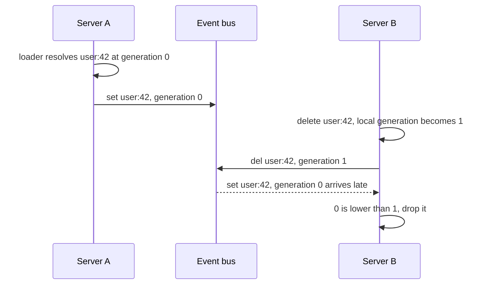

A cache is a copy, and a copy has no way of knowing when the original changed. Nobody tells it. Correctness depends entirely on something else remembering to say so, at the right moment, to every server holding a copy, and none of those three is guaranteed by anything in the system.

That is the whole of why invalidation has a reputation. It is not one hard problem. It is three, and they fail independently.

## Living on TTLs alone

The simplest answer is to admit you will be wrong and put a clock on it. Cache for 60 seconds, accept that a write can be invisible for up to 60 seconds, move on.

This works right up until you write down what you are actually choosing.

| TTL | Worst case staleness | Loads per key per hour, per server |
| --- | --- | --- |
| 1 hour | 1 hour | 1 |
| 60 seconds | 60 seconds | 60 |
| 5 seconds | 5 seconds | 720 |
| 1 second | 1 second | 3,600 |

Staleness and origin load are the same dial turned in opposite directions, and the dial is badly shaped. Almost every expiry is wasted work, because most keys did not change during their TTL. You reload a value 3,600 times an hour to catch the one write that happened at minute 34, and you are still stale for up to a second when it does.

Worse, TTL gives you no way to say "this one is wrong now". A price changed, a permission was revoked, a user deleted their account, and the cache keeps serving the old answer until a timer that knows nothing about any of it happens to fire.

## Saying it out loud instead

An event bus lets the server that made the change tell everyone else. Staleness stops being a function of your TTL and becomes a function of how long the bus takes to deliver, which is typically milliseconds.

TTL does not go away. It changes job, from being the mechanism that keeps the cache honest to being the safety net for the case where a message did not arrive.

<CodeGroup>
```js src/users/repository.js
import { cache } from '../cache/index.js'
import { db } from '../db.js'

export async function updateUser(id, patch) {
  // Invalidate after the write commits. Until it does, the cached value is
  // still the truth, and a delete now would only reload the old row.
  const updated = await db.users.update(id, patch)

  // Drops the key from L1, L2, the negative cache, the stale copy and any
  // in-flight promise, here and on every peer.
  await cache.delete(`user:${id}`)

  // A whole prefix at once. This scans L2, so keep the prefix narrow.
  await cache.deleteByPattern(`user:${id}:sessions:*`)

  return updated
}
```

```ts src/users/repository.ts
import { cache } from '../cache/index.js'
import { db } from '../db.js'
import type { User } from '../types/user.js'

export async function updateUser(id: string, patch: Partial<User>): Promise<User> {
  // Invalidate after the write commits. Until it does, the cached value is
  // still the truth, and a delete now would only reload the old row.
  const updated = await db.users.update(id, patch)

  // Drops the key from L1, L2, the negative cache, the stale copy and any
  // in-flight promise, here and on every peer.
  await cache.delete(`user:${id}`)

  // A whole prefix at once. This scans L2, so keep the prefix narrow.
  await cache.deleteByPattern(`user:${id}:sessions:*`)

  return updated
}
```
</CodeGroup>

<Warning>
  `deleteByPattern('*')` scans the entire keyspace on every server that receives it. Prefix patterns tightly, and never build one out of user input.
</Warning>

## Three event types, one of which carries a value

| Type | Published by | What a peer does with it |
| --- | --- | --- |
| `del` | `cache.delete(key)` | Drops the key from L1, L2, the negative cache, the stale copy and any in-flight promise |
| `pattern` | `cache.deleteByPattern(p)` and `cache.clear()` | Drops every local entry whose key matches the pattern |
| `set` | a `getOrSet` loader resolving | Writes the value straight into its own L1 |

`del` and `pattern` say only what to forget. `set` is the one that carries the loaded value itself, which is what turns a fleet of caches from a group that all reload independently into one where a single server's query warms everybody. That path is the [lazy fan-out](/docs/concepts/lazy-loading#the-lazy-fan-out), and it has two caveats worth knowing before you rely on it.

Every event carries `source`, `ts`, an `id`, and, for `del` and `set`, a per-key `generation`.

## Buses lose, duplicate, and reorder

A message bus is not a promise of correctness. It is a promise of best effort, and everything it does badly can undo an invalidation:

- it can deliver the same event twice
- it can deliver events out of order
- it can deliver your own event back to you
- it can fail to deliver at all, to a server that was disconnected

Three mechanisms handle the first three. The fourth is a property of the transport you chose, not something a cache can fix, which is why [choosing an event bus](/docs/guides/event-buses) is a real decision.

### Dedupe by event ID

Every published event gets an `id`. Each server keeps the IDs it has already applied and drops repeats, emitting `invalidation:duplicate` instead of applying the work a second time.

The set of remembered IDs is bounded on both axes: `eventDedupeMaxEntries` defaults to 10,000 and `eventDedupeTtlMs` defaults to five minutes. Redelivery outside that window is applied again, which is safe for a delete and merely wasteful for a `set`.

An event that arrives without an `id`, from an older peer, gets a synthetic one built from its source, timestamp, type and keys, so it still deduplicates.

### Filter your own events

A server that publishes an event also receives it back on a fanout bus. Applying it would mean undoing its own work, so `event.source === this.source` returns early and nothing happens.

This is why `source` has to be unique per server. Leave it unset and a random identifier is generated per process, which works but tells you nothing when you are reading logs. Set it to something stable and recognisable, such as the pod name or instance ID.

<Warning>
  Two servers sharing one `source` value will each ignore the other's events, believing them to be their own. This is a silent correctness bug, not an error.
</Warning>

### Late events cannot resurrect a deleted value

This is the one that matters most, because it is the failure that produces a wrong answer rather than a redundant one.

Every server keeps a per-key generation counter. Deleting a key advances it, and the published `del` event carries the new number. A `set` event carries the generation the value was loaded at.

When an event arrives carrying a generation lower than the receiver's own counter for that key, the receiver knows the event describes a world that has already moved on. It drops it and emits `invalidation:stale`.



Without the counter, that late `set` would write a deleted user back into B's L1 and it would stay there until its TTL expired. With it, the delete wins no matter which order the messages land in.

Three honest limits on this:

- Equal generations are applied, not dropped. The counter guards against older events, it does not impose a total order, so within one generation the last event to arrive wins.
- The counters live in memory, per server. A restart resets them to zero, and the server relearns them from the events it then receives.
- `pattern` events carry no generation at all, so they apply whenever they arrive. One more reason to keep patterns narrow.

Turning on `versioning` goes further and folds the generation into the storage key itself, so an old value is not merely ignored, it is not addressable. [Event ordering](/docs/architecture/event-ordering) has the full picture.

## What invalidation still does not give you

It is worth being clear about the boundary. This machinery keeps copies from disagreeing under normal bus behaviour. It is not a consensus protocol.

A server that was disconnected while the delete went past does not learn about it on reconnect unless your transport is durable. Its TTL is what saves you, which is the real reason a short L1 TTL is worth paying for even when you have a bus.

## Where to next

<CardGroup cols={2}>
  <Card title="Event ordering" icon="arrow-down-1-9" href="/docs/architecture/event-ordering">
    The three ordering mechanisms in detail, and exactly what is not guaranteed.
  </Card>
  <Card title="Choosing an event bus" icon="tower-broadcast" href="/docs/guides/event-buses">
    What each transport promises a server that was offline when the event went out.
  </Card>
  <Card title="Lazy loading" icon="bolt" href="/docs/concepts/lazy-loading">
    The `set` event from the other side, where one server's query warms the fleet.
  </Card>
</CardGroup>
