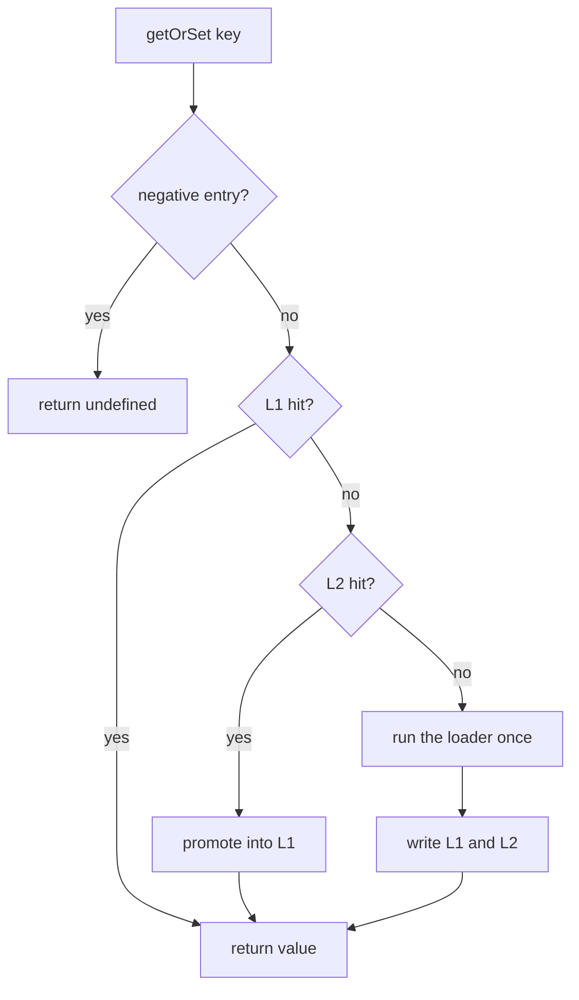

Pick one cache layer and you have picked a failure mode. The two layers exist because "fast" and "shared" are different questions, and answering them with one piece of infrastructure means answering one of them badly.

## One layer, two ways to be unhappy

**Memory only.** Reads are as fast as a map lookup, and that is the end of the good news. Every server holds its own copy of everything, so a fleet of forty servers holds forty copies and pays for forty cold starts. A restart throws the whole thing away. Each server only ever benefits from its own traffic, so your hit rate falls as you add capacity, which is exactly backwards.

**Shared store only.** Now there is one copy, it survives restarts, and every server sees the same value. But the key you read four hundred times a second costs a network round trip and a decode every single time, and your read path now fails when Redis does.

Two layers is not a compromise between those. L1 answers "how fast is a repeat read on this server". L2 answers "what does the fleet agree on, and what survives a deploy". Neither answer degrades the other.

## L1, the copy in this process

L1 is an LRU inside your process heap, holding live JavaScript objects. A hit costs a map lookup. Nothing is serialized, nothing crosses a socket.

It is created for you when you do not pass `l1`, and it has exactly two dials.

| Dial | Default | What it controls |
| --- | --- | --- |
| `levels.L1.maxEntries` | `1_000` | How many keys the LRU holds before it evicts the least recently used one |
| `levels.L1.ttlMs` | falls back to `ttlMs`, then one hour | How long an entry lives regardless of use |

There is no third dial. The eviction policy is LRU and is not configurable, there is no byte based limit, and there is no LFU or FIFO mode.

L1 lives in the process, so it is per server. Three servers means three L1 caches that know nothing about each other. Closing that gap is the job of the event bus, through the [lazy fan-out](/docs/concepts/lazy-loading#the-lazy-fan-out) and [invalidation](/docs/concepts/invalidation), not of L1 itself.

Its blast radius is small, and that is its other virtue. A wrong value in L1 affects one server, expires at its TTL, and dies with the process.

## L2, the copy everybody shares

L2 is optional and shared. `RedisStore` is the implementation in the package, and it stores bytes rather than objects, so values are encoded on the way in and decoded on the way out. [Serialization](/docs/concepts/serialization) covers the format.

<CodeGroup>
```js src/cache/index.js
import { LazyLayersCache, RedisStore } from 'lazy-layers-cache'
import { redis } from './redis.js'

export const cache = new LazyLayersCache({
  levels: {
    // Short in memory, so a wrong value cannot linger on one server.
    L1: { maxEntries: 10_000, ttlMs: 60 * 1000 },
    // Long in the shared tier, because it is what absorbs the load.
    L2: { ttlMs: 60 * 60 * 1000 },
  },

  l2: new RedisStore(redis, {
    prefix: 'app:cache:',
    deleteStrategy: 'unlink',
    scanCount: 500,
  }),
})
```

```ts src/cache/index.ts
import { LazyLayersCache, RedisStore, type LazyLayersCacheOptions } from 'lazy-layers-cache'
import type { User } from '../types/user.js'
import { redis } from './redis.js'

const options: LazyLayersCacheOptions<string, User> = {
  levels: {
    // Short in memory, so a wrong value cannot linger on one server.
    L1: { maxEntries: 10_000, ttlMs: 60 * 1000 },
    // Long in the shared tier, because it is what absorbs the load.
    L2: { ttlMs: 60 * 60 * 1000 },
  },

  l2: new RedisStore<User>(redis, {
    prefix: 'app:cache:',
    deleteStrategy: 'unlink',
    scanCount: 500,
  }),
}

export const cache = new LazyLayersCache<string, User>(options)
```
</CodeGroup>

L2 survives a restart, is visible to every server, and catches what L1 evicts. It costs a round trip, and it can fail. When it does, the failure is treated as a miss rather than an exception, so the read falls through to your loader and the request still completes. [Resilience](/docs/concepts/resilience#fail-open) covers what that degradation looks like.

Its blast radius is the opposite of L1's. A wrong value in L2 is served to every server and outlives every restart until something deletes it. That is why writes invalidate L2 explicitly instead of waiting for its TTL to come around.

## How a read walks the layers



The promotion step is what makes the second read cheap. A value found in L2 is written into L1 before it is returned, so the next read on that server never touches the network. The round trip is paid once per server per TTL, not once per request.

## What each layer is for

| | L1 | L2 |
| --- | --- | --- |
| Holds | live objects | encoded bytes |
| Cost of a hit | a map lookup | a round trip plus a decode |
| Scope | one process | the whole fleet |
| Survives a restart | no | yes |
| When it fails | it cannot, it can only evict or expire | treated as a miss, the read continues |
| A wrong value affects | one server, until its TTL | every server, until it is deleted |

## Sizing L1 by entry count

`maxEntries` is the only size dial, and it counts entries, not bytes. Translating that into memory is your job, and it is arithmetic you have to do with your own value sizes.

Multiply the entry count by a typical decoded value size, then keep the result to a fraction of the heap you are willing to spend.

| Typical value | Rough size | 10,000 entries | Reasonable ceiling |
| --- | --- | --- | --- |
| Session or flag | ~200 B | ~2 MB | 50,000+ |
| User record | ~2 KB | ~20 MB | 10,000 |
| Rendered list page | ~18 KB | ~180 MB | 1,000 |

<Note>
  These are estimates, not measurements. There is no byte based limit, so one unexpectedly large value counts as a single entry no matter how big it is, and one of those can blow straight past your estimate.
</Note>

`ttlMs` is a size dial too, and an easier one to reason about. A shorter L1 TTL means fewer entries are alive at any moment, which caps memory by turnover rather than by count.

Under Node clustering, every worker keeps its own L1 in its own heap. Budget `maxEntries x workers`, not `maxEntries`.

## TTLs resolve from most specific to least

1. per call `options.levels.L1.ttlMs` or `options.levels.L2.ttlMs`
2. per call `options.ttlMs`
3. constructor `levels.L1.ttlMs` or `levels.L2.ttlMs`
4. constructor `ttlMs`
5. `DEFAULT_CACHE_TTL_MS`, which is one hour

A short L1 TTL with a longer L2 TTL is the usual arrangement. Memory turns over quickly, the shared tier keeps absorbing the load, and no single server holds anything for long.

## Running with one layer

Either layer can be removed by passing `false`.

| Configuration | Behaviour |
| --- | --- |
| Neither `l1` nor `l2` set | L1 only. The default. |
| `l2` set | L1 and L2, with promotion. |
| `l1: false` | L2 only. Every read crosses the network. |
| `l1: false, l2: false` | No caching. Every `getOrSet` runs the loader. |

L1 only is the right shape for a single process with no peers, where there is nobody to share with and nothing to invalidate. `l1: false` is occasionally useful when many processes share one machine and holding the same objects several times over is the thing you are trying to avoid, at the cost of a round trip on every read.

## Where to next

<CardGroup cols={2}>
  <Card title="Lazy loading" icon="bolt" href="/docs/concepts/lazy-loading">
    How a value gets into these layers, and how one server's load warms every peer's L1.
  </Card>
  <Card title="Invalidation" icon="arrows-rotate" href="/docs/concepts/invalidation">
    What keeps three separate L1 caches from disagreeing with each other.
  </Card>
  <Card title="Single process setup" icon="server" href="/docs/setups/single-process">
    The L1 only configuration in full, with TTLs chosen and explained.
  </Card>
</CardGroup>
