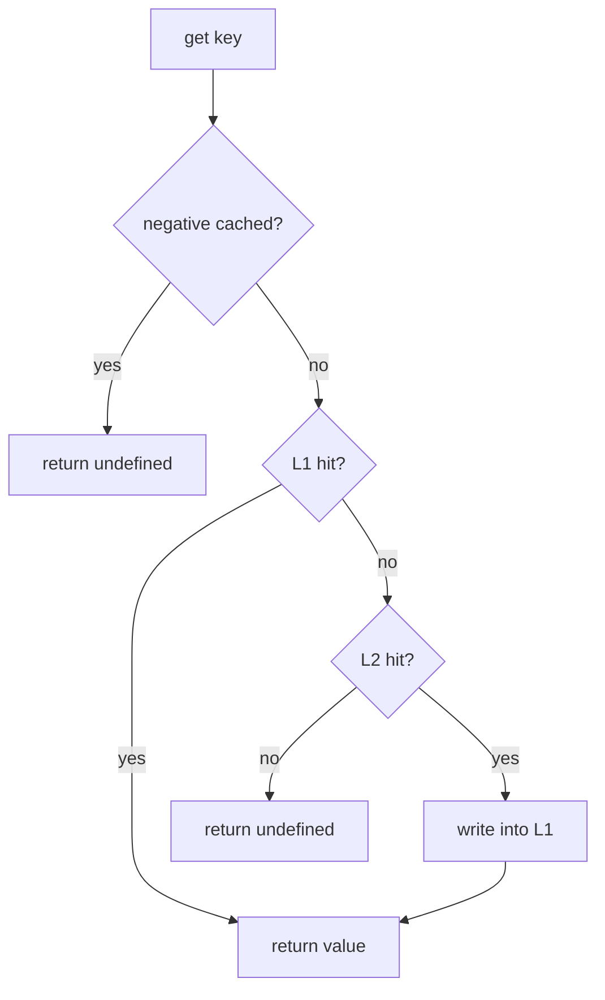

LazyLayers has two cache layers. They hold different things and fail differently.

## L1: in-process memory

L1 is an LRU cache inside your process, backed by `lru-cache`. It stores live JavaScript objects, so a hit costs a map lookup and nothing else. No serialization, no network.

It is created for you unless you say otherwise. The defaults are 1,000 entries and the cache-wide `ttlMs`.

```ts
const cache = new LazyLayersCache({
  levels: { L1: { maxEntries: 10_000, ttlMs: 30_000 } },
});
```

Because L1 lives in the process, it is per-instance. Three servers means three L1 caches that know nothing about each other, which is the problem [invalidation](/docs/concepts/invalidation) exists to solve.

## L2: shared store

L2 is optional and shared. `RedisStore` is the implementation in the package.

```ts
import Redis from 'ioredis';
import { RedisStore } from 'lazy-layers-cache';

const cache = new LazyLayersCache({
  l2: new RedisStore(new Redis(process.env.REDIS_URL), { prefix: 'app:' }),
});
```

L2 stores bytes, not objects, so values are encoded on the way in and decoded on the way out. That encoding is described in [serialization](/docs/concepts/serialization).

L2 survives a restart and is visible to every instance. It costs a network round trip and it can fail, which is why L2 errors are treated as misses rather than exceptions.

## How a read walks the layers



The promotion step matters. A value found in L2 is written into L1 before it is returned, so the next read on that instance is a memory hit. That is what makes the second request cheap even though the first one crossed the network.

## Running with one layer

Both layers can be switched off by passing `false`.

| Configuration | Behaviour |
| --- | --- |
| Neither set | L1 only. The default. |
| `l2` set | L1 and L2, with promotion. |
| `l1: false` | L2 only. Every read crosses the network. |
| `l1: false, l2: false` | No caching. Every `getOrSet` runs the loader. |

`l1: false` is occasionally useful when many processes share one machine and you would rather not hold the same objects several times over. It costs you the memory hit on every read.

## TTLs

TTLs resolve from the most specific setting to the least:

1. per-call `options.levels.L2.ttlMs`
2. per-call `options.ttlMs`
3. constructor `levels.L2.ttlMs`
4. constructor `ttlMs`
5. `DEFAULT_CACHE_TTL_MS`, which is one hour

A common arrangement is a short L1 TTL and a longer L2 TTL, so memory turns over quickly while the shared tier absorbs the load.

```ts
const cache = new LazyLayersCache({
  levels: {
    L1: { ttlMs: 10_000, maxEntries: 1_000 },
    L2: { ttlMs: 300_000 },
  },
});
```
