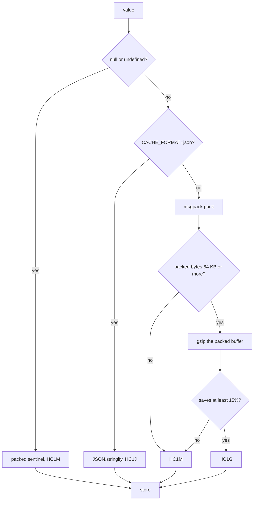

L1 holds live JavaScript objects, so nothing is encoded there. Everything that leaves the process is encoded: values written to L2, and the invalidation events that travel between servers.

Both go through the same function. `encodeInvalidationEvent` is a call to `serialize`, so a `set` event carrying a loaded value is packed exactly the way that value would be packed in Redis. That is also why `broadcastSetMaxBytes` is measured against the encoded event rather than against your object.

Three encodings exist, one is chosen per payload, and every buffer carries a 4-byte tag naming its own format.

## Why not JSON

`JSON.stringify` is native, extremely well optimised, and readable in `redis-cli`. It is not a bad format. It is a format that spends bytes describing a shape you already know.

Take the session fixture the benchmarks use, the smallest and hottest shape in most applications:

```json
{"uid":"eb3d0a1b7971473bc9882c2e","sid":"97c71aa27740355591bd1c6360deaef8","exp":1740086400000,"scopes":["read","write"],"ip":"10.243.49.222"}
```

That is 142 bytes. Here is where they go:

| Part of the document | Bytes |
| --- | --- |
| Structural punctuation (`{}[]",:`) | 34 |
| Key names, repeated on every record | 17 |
| Actual values | 91 |
| **Total** | **142** |

Fifty one bytes carry no information. They are there because JSON is a text format that has to re-explain the record's structure to every reader, on every record, forever. Multiply that by every session in a cache holding several million of them.

MessagePack encodes the same record in 119 bytes, and LazyLayers stores 123 of them once the 4-byte tag is on the front. Lengths become length bytes instead of quotes and commas. Numbers become numbers instead of decimal digits. Nothing about your data changed.

<Note>
  The benchmark headline compares what actually lands in Redis, which for the comparison target is JSON plus the entry envelope wrapped around it. On that basis the session record is 212 bytes against 123. The 142 bytes above is the record on its own, with no envelope, so you can see where JSON's overhead comes from rather than just how large the total is.
</Note>

## The three encodings

Each stored buffer begins with four ASCII bytes naming its own format.

| Prefix | Encoding | Chosen when |
| --- | --- | --- |
| `HC1M` | MessagePack | The default for any payload |
| `HC1G` | gzip over MessagePack | The packed buffer is at least 64 KB **and** gzip saves at least 15% |
| `HC1J` | JSON | `CACHE_FORMAT=json`, or `CACHE_DEBUG_SERIALIZATION=true` |

The two constants are `GZIP_MIN_BYTES`, which is `64 * 1024`, and a savings threshold of 15%. Both are compared against the **MessagePack** buffer, not against your object and not against its JSON form. A payload that JSON would render at 90 KB but MessagePack packs to 40 KB is never gzipped, because 40 KB is under the floor.



The second half of the gzip condition is the part that earns its place. Already compressed images, encrypted blobs and high entropy identifiers do not compress. Without the check you would pay the CPU and store a buffer that is the same size or larger. With it, the compressed result is measured and thrown away when it does not clear the bar, and the plain MessagePack buffer is stored instead.

<Warning>
  Throwing it away still costs you the gzip. Any payload over 64 KB packed is compressed at least once per write, even when the result is discarded. If you cache large incompressible values, that is real CPU spent for nothing, and the only lever is to stop putting them in the cache.
</Warning>

`null` and `undefined` both encode to a packed sentinel string under `HC1M`, 25 bytes in total, and decode back to `null`. That is what keeps a deliberately cached `null` distinguishable from an absent key: `RedisStore.get` returns `undefined` before decoding anything when Redis has no key at all.

## What the trade actually is

Smaller payloads cost CPU. This is the honest shape of it, measured by `benchmarks/run.mjs` against `JSON.stringify` including the entry envelope the comparison library stores.

| Fixture | JSON bytes | LazyLayers bytes | Saved | Encoding | Serialize speed | Deserialize speed |
| --- | --- | --- | --- | --- | --- | --- |
| Session token | 212 | 123 | 42.0% | `msgpack` | 0.52x | 0.99x |
| User profile | 424 | 284 | 33.0% | `msgpack` | 0.69x | 0.75x |
| API list, 50 records | 18,127 | 14,140 | 22.0% | `msgpack` | 0.76x | 0.72x |
| Metrics, 1,440 points | 119,155 | 30,393 | 74.5% | `msgpack-gzip` | 0.21x | 0.61x |
| Product catalogue, 400 records | 125,568 | 9,903 | 92.1% | `msgpack-gzip` | 0.23x | 0.60x |

Speeds below 1.0x mean slower than `JSON.stringify`. Across the fixture set that is roughly 0.2x to 0.8x. You are buying 22% to 92% fewer bytes with CPU cycles.

<Note>
  Byte counts are deterministic. The fixtures are seeded, so `run.mjs` reproduces those sizes exactly on any machine. Throughput is a median of fixed iteration reps and moves with your CPU, Node version and thermal state, so compare the ratios rather than the absolute numbers. Both libraries are asserted to round-trip every fixture to a deeply equal value, so a win can never come from dropping data.
</Note>

That trade is good when bytes are the metered resource. Managed Redis is sold by memory, cross-zone network transfer is billed, and replication multiplies both. It is a bad trade for a tiny key serialized millions of times a second on a CPU that is already your bottleneck, where JSON's raw speed wins and the handful of bytes you saved buy nothing.

The two gzip rows are where the shape becomes obvious. The catalogue packs to 113,541 bytes of MessagePack and stores 9,903 after gzip, a saving of 91.3% on top of what MessagePack already did. That is 400 records sharing one boilerplate description, which is exactly the repetition gzip exists for.

## The prefix is what makes a rolling deploy safe

The reason each buffer names its own format is not tidiness. It is that during a deploy, two versions of your code read the same Redis.

Imagine you raise the gzip threshold, or drop `CACHE_FORMAT=json` in staging, or a future release adds a fourth encoding. Half the fleet writes the old way and half writes the new way, at the same time, into the same keyspace, for as long as the rollout takes.

Nothing has to be coordinated, because the reader never assumes. It compares four bytes and dispatches to the matching decoder. A value written by an old server decodes on a new one and the other way round, and there is no migration, no dual-write window and no version field to keep in sync.

Three cases fall out of that, all verified against the decoder:

- A buffer with no recognised prefix is treated as legacy. Raw MessagePack written before prefixes existed decodes normally, and so does a bare JSON string.
- A prefix the reader does not know decodes to `null`, which becomes a cache miss and runs your loader. An unknown future encoding degrades to a slow read, not an exception.
- Reading is entirely independent of the write policy, so `CACHE_FORMAT` can differ per environment, or per server mid-rollout, without anything breaking.

## Corruption is not an exception

A truncated buffer, a damaged gzip stream and a half-written value all return `null` rather than throwing.

That is deliberate, and it is the same stance as everything else in [resilience](/docs/concepts/resilience#fail-open). A damaged cache entry becomes a miss, your loader runs, the request completes. It does not become a 500 for a value that was only ever an optimisation.

## Inspecting what a value costs

`serializeWithStats` returns the buffer alongside what happened to it, which is how you answer "is this key worth caching" with a number rather than an opinion.

<CodeGroup>
```js src/catalog/repository.js
import { serializeWithStats } from 'lazy-layers-cache'
import { cache } from '../cache/index.js'
import { db } from '../db.js'

export async function getCatalog() {
  return cache.getOrSet('catalog:v1', async ({ signal } = {}) => {
    const catalog = await db.products.list({ signal })

    // Measure what this value will cost on the wire before it goes anywhere.
    const stats = serializeWithStats(catalog)
    logger.info({
      encoding: stats.encoding,      // 'msgpack-gzip'
      packedBytes: stats.originalBytes, // 113541
      storedBytes: stats.storedBytes,   // 9903
      saved: stats.compressionRatio,    // 0.9128, gzip savings over msgpack
    }, 'catalog encoded')

    return catalog
  })
}
```

```ts src/catalog/repository.ts
import { serializeWithStats } from 'lazy-layers-cache'
import type { Catalog } from '../types/catalog.js'
import { cache } from '../cache/index.js'
import { db } from '../db.js'

export async function getCatalog(): Promise<Catalog | undefined> {
  return cache.getOrSet('catalog:v1', async ({ signal } = {}) => {
    const catalog = await db.products.list({ signal })

    // Measure what this value will cost on the wire before it goes anywhere.
    const stats = serializeWithStats(catalog)
    logger.info({
      encoding: stats.encoding,      // 'msgpack-gzip'
      packedBytes: stats.originalBytes, // 113541
      storedBytes: stats.storedBytes,   // 9903
      saved: stats.compressionRatio,    // 0.9128, gzip savings over msgpack
    }, 'catalog encoded')

    return catalog
  })
}
```
</CodeGroup>

`compressionRatio` is the fraction saved by gzip relative to the MessagePack buffer, so it is `0` on anything stored as plain `msgpack`. `originalBytes` is the packed size and `storedBytes` includes the prefix.

The [observability dashboard](/docs/guides/observability) shows the encoding and the stored size per key, which is the same question asked across your whole keyspace instead of one value at a time.

<Note>
  Encoded size is also what decides whether a peer gets primed. `broadcastSetMaxBytes` is compared against the encoded `set` event, so this is the number to pick that ceiling from.
</Note>

## Storing readable JSON instead

Set `CACHE_FORMAT=json` and writes become `HC1J`, which is `JSON.stringify` with a tag on the front. `CACHE_DEBUG_SERIALIZATION=true` does the same thing.

Values are then readable with `redis-cli`, at the cost of every byte the rest of this page was about. Because the read path dispatches on the prefix, you can turn it on in one environment, or on one server, and every existing binary value keeps decoding.

Use it to debug an encoding question in staging. It is not a production setting.

## Where to next

<CardGroup cols={2}>
  <Card title="Layers" icon="layer-group" href="/docs/concepts/layers">
    Where these bytes actually land, and why L1 never pays the encoding cost.
  </Card>
  <Card title="Lazy loading" icon="bolt" href="/docs/concepts/lazy-loading#the-lazy-fan-out">
    The fan-out that sends an encoded value to every server, and the ceiling you put on it.
  </Card>
  <Card title="Environment variables" icon="sliders" href="/docs/reference/environment-variables#serialization">
    The two variables that select the JSON encoding, and how they resolve against code options.
  </Card>
</CardGroup>
