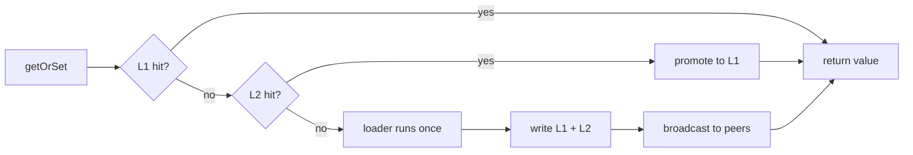

LazyLayers is a caching library for Node.js. It starts as an in-process LRU cache with no infrastructure, and grows into a distributed cache layer as you need one: a shared Redis tier, an event bus that keeps every instance in agreement, and a binary wire format that cuts what you store.

Two methods do almost all the work.

```ts
// Read through the layers, load once if nothing has it.
// The loader runs on one server. That server then broadcasts the value on the
// event bus, so every other server stores it lazily in its own L1 without ever
// touching the database.
const user = await cache.getOrSet(`user:${id}`, () => db.users.findById(id));

// Invalidate everywhere. Every instance drops the key.
await cache.delete(`user:${id}`);
```

`getOrSet` is the read path. `delete` is the write path. Everything else on this site is about what happens between them.

## Why it exists

A single-process cache is easy. `Map` will do.

The difficulty starts when you run more than one instance. Each one keeps its own memory cache, so a write on one server is invisible to the others until their TTL expires. Your staleness window stops being a number you chose and becomes your TTL multiplied by the share of traffic that never touched the server that wrote.

You can shorten the TTL, but that just trades staleness for load on your database. LazyLayers takes the other route: when one instance writes, it tells the others.

## The three pieces

```ts cache.ts expandable
import Redis from 'ioredis';
import { LazyLayersCache, RedisStore, RedisEventBus } from 'lazy-layers-cache';

interface User {
  id: string;
  name: string;
  plan: 'free' | 'pro';
}

const redis = new Redis(process.env.REDIS_URL!);

// 1. The bus. Carries invalidations between instances.
const eventBus = new RedisEventBus(redis, 'app:invalidations', {
  retryQueue: { enabled: true, maxSize: 10_000 },
});

const health = await eventBus.healthCheck();
if (!health.ok) throw new Error(`cache bus unhealthy: ${JSON.stringify(health)}`);

// 2. The cache. Two layers, plus the bus.
export const cache = new LazyLayersCache<string, User>({
  // L1: in-process, holds live objects, nanosecond reads
  levels: {
    L1: { maxEntries: 10_000, ttlMs: 10_000 },
    L2: { ttlMs: 300_000 },
  },

  // L2: shared across instances, holds MessagePack bytes
  l2: new RedisStore<User>(redis, { prefix: 'users:' }),

  // 3. Invalidation. `source` is how an instance ignores its own events.
  eventBus,
  source: process.env.INSTANCE_ID,
  broadcastSet: true,
});
```

Read through both layers:

```ts
// L1 miss falls to L2, L2 miss runs the loader. Whichever server does the work
// publishes a `set` event carrying the value, and every peer writes it straight
// into its own L1. One database read warms the entire fleet.
const user = await cache.getOrSet(`user:${id}`, () => db.users.findById(id));
```

Invalidate across every instance:

```ts
await cache.delete(`user:${id}`);        // one key, everywhere
await cache.deleteByPattern('users:*');  // a whole prefix, everywhere
```

## What the bus carries

Three event types travel between instances. Only one carries a value.

| Event | Published when | What peers do |
| --- | --- | --- |
| `del` | `cache.delete(key)` | Drop the key from L1, L2, negative, stale and inflight |
| `pattern` | `cache.deleteByPattern(p)` | Drop every local entry matching the pattern |
| `set` | A `getOrSet` loader returns | Write the value straight into L1 |

That last one is the difference between peers *invalidating* and peers being *primed*. Invalidation makes every instance reload the key independently. Priming means one instance pays for the load and the rest take the result.

## How a read walks the layers



## Core concepts

<Columns cols={2}>
  <Card title="Layers" icon="layers" href="/docs/concepts/layers">
    L1 holds live objects in memory. L2 is shared and holds encoded bytes.
  </Card>
  <Card title="Lazy loading" icon="download" href="/docs/concepts/lazy-loading">
    `getOrSet` is the read-through path, and where stampede protection lives.
  </Card>
  <Card title="Invalidation" icon="radio" href="/docs/concepts/invalidation">
    Three event types travel between instances. Only one carries a value.
  </Card>
  <Card title="Serialization" icon="binary" href="/docs/concepts/serialization">
    Three wire encodings, chosen per payload at write time.
  </Card>
</Columns>

## Where to go next

<Columns cols={2}>
  <Card title="Quickstart" icon="rocket" href="/docs/quickstart">
    A full production configuration, every option explained.
  </Card>
  <Card title="Walkthrough" icon="route" href="/docs/walkthrough">
    Take one service from a single process to a synchronised cluster.
  </Card>
  <Card title="Recommended setups" icon="sliders" href="/docs/setups/multi-instance">
    Copyable configurations with TTL guidance.
  </Card>
  <Card title="Event buses" icon="git-branch" href="/docs/guides/event-buses">
    Redis, RabbitMQ, NATS Core and NATS JetStream compared.
  </Card>
</Columns>
