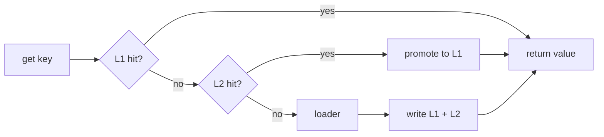

LazyLayers is a caching library for Node.js. It starts as an in-process LRU cache with no infrastructure, and grows into a distributed cache layer as you need one: a shared Redis tier, an event bus that keeps every instance in agreement, and a binary wire format that cuts what you store.

The API is small. Most applications use four methods:

```ts
await cache.set('user:42', user);
const user = await cache.get('user:42');
const user = await cache.getOrSet('user:42', () => db.users.findById(42));
await cache.delete('user:42');
```

## Why it exists

A single-process cache is easy. `Map` will do.

The difficulty starts when you run more than one instance. Each one keeps its own memory cache, so a write on one server is invisible to the others until their TTL expires. Your staleness window stops being a number you chose and becomes your TTL multiplied by the share of traffic that never touched the server that wrote.

You can shorten the TTL, but that just trades staleness for load on your database. LazyLayers takes the other route: when one instance writes, it tells the others.

## How it works

Reads walk down the layers and stop at the first hit. A hit in L2 is promoted into L1 on the way back, so the next read on that instance never leaves the process.



When a `getOrSet` loader returns, the value is written to both layers and broadcast to every peer, so their L1 fills without calling the loader again.

## Core concepts

<Columns cols={2}>
  <Card title="Layers" icon="layers" href="/concepts/layers">
    L1 holds live objects in memory. L2 is shared and holds encoded bytes.
  </Card>
  <Card title="Lazy loading" icon="download" href="/concepts/lazy-loading">
    `getOrSet` is the read-through path, and where stampede protection lives.
  </Card>
  <Card title="Invalidation" icon="radio" href="/concepts/invalidation">
    Three event types travel between instances. Only one carries a value.
  </Card>
  <Card title="Serialization" icon="binary" href="/concepts/serialization">
    Three wire encodings, chosen per payload at write time.
  </Card>
</Columns>

## A small example

```ts
import { LazyLayersCache } from 'lazy-layers-cache';

const cache = new LazyLayersCache({ ttlMs: 60_000 });

const user = await cache.getOrSet(`user:${id}`, () => db.users.findById(id));
```

Ten thousand callers asking for the same cold key share one loader call. That behaviour is on by default and is described in [stampede protection](/guides/stampede-protection).

## Where to go next

<Columns cols={2}>
  <Card title="Quickstart" icon="rocket" href="/quickstart">
    Install it and cache something in about five minutes.
  </Card>
  <Card title="Walkthrough" icon="route" href="/walkthrough">
    Take one service from a single process to a synchronised cluster.
  </Card>
  <Card title="Configuration" icon="sliders" href="/reference/configuration">
    Every option, its default, and what it changes.
  </Card>
  <Card title="Execution paths" icon="git-branch" href="/architecture/execution-paths">
    What actually runs on a read, a write and a load.
  </Card>
</Columns>
