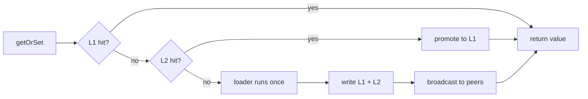

**LazyLayers** is a production-grade multi-tier caching engine for Node.js applications that bridges the gap between local in-memory speed (`<0.1ms`) and distributed consistency. It starts as an in-process LRU cache with zero external dependencies, and progressively scales into a fully synchronized distributed cache tier.

```bash
npm install lazy-layers-cache
```

## Two methods do all the work

```ts
// Read through layers, load once if nothing has it.
// The loader runs on one server. That server then broadcasts the value on the
// event bus, so every other peer warms its L1 without touching the database.
const user = await cache.getOrSet(`user:${id}`, () => db.users.findById(id));

// Invalidate everywhere. Every server drops the key across all layers.
await cache.delete(`user:${id}`);
```

---

## ✨ Key Features & Capabilities

<CardGroup cols={2}>
  <Card title="Multi-Tier Hybrid Caching" icon="layer-group">
    Sub-0.1ms in-process L1 LRU memory + shared remote L2 Redis with automated promotion, TTL countdowns, and tiering.
  </Card>
  <Card title="Size-Tiered Binary Compression" icon="file-zipper">
    Native MessagePack + dynamic LZ4/Zstd compression (33%–92% smaller wire payloads than raw JSON and metadata envelopes).
  </Card>
  <Card title="Thundering Herd Stampede Protection" icon="shield-check">
    In-flight Promise deduplication (10,000 concurrent callers for a cold key = 1 database query) + Redis distributed locks.
  </Card>
  <Card title="Fleet Synchronization via Event Bus" icon="tower-broadcast">
    Real-time cross-instance cache invalidation and lazy value priming over **Redis Pub/Sub**, **RabbitMQ**, **NATS Core**, or **NATS JetStream**.
  </Card>
  <Card title="Fail-Open Resilience & Circuit Breaking" icon="bolt-slash">
    If Redis or message brokers degrade, traffic gracefully fails open to L1 RAM / DB without blocking threads or throwing 500 errors.
  </Card>
  <Card title="Grace Periods & Fail-Safe Stale Fallbacks" icon="clock-rotate-left">
    Serves stale cached copies during upstream database outages to guarantee 100% application uptime.
  </Card>
  <Card title="Negative Caching (404 Protection)" icon="ban">
    Automatically caches missing keys (`null`/`undefined`) with short TTLs to protect origin databases against penetration attacks.
  </Card>
  <Card title="Deterministic Causal Ordering" icon="arrow-down-1-9">
    Instance identity (`source`), event deduplication, and per-key generation counters prevent out-of-order writes and loopback self-echos.
  </Card>
  <Card title="Real-Time Observability Suite" icon="chart-line">
    Zero-dependency live dashboard at `/__lazylayers` with Light/Dark mode, interactive canvas Bezier sparklines, and L1/L2 memory inspectors.
  </Card>
  <Card title="Native Prometheus Metrics" icon="gauge">
    Direct Prometheus exposition at `/__lazylayers/metrics` and `node:diagnostics_channel` telemetry event stream.
  </Card>
</CardGroup>

---

## The three pieces

```ts cache.ts expandable
import Redis from 'ioredis';
import { LazyLayersCache, RedisStore, RedisEventBus } from 'lazy-layers-cache';

interface User {
  id: string;
  name: string;
  plan: 'free' | 'pro';
}

const redis = new Redis(process.env.REDIS_URL!);

// 1. The bus. Carries invalidations between instances.
const eventBus = new RedisEventBus(redis, 'app:invalidations', {
  retryQueue: { maxSize: 10_000 },
});

const health = await eventBus.healthCheck();
if (!health.ok) throw new Error(`cache bus unhealthy: ${JSON.stringify(health)}`);

// 2. The cache. Two layers, plus the bus.
export const cache = new LazyLayersCache<string, User>({
  // L1: in-process, holds live objects, nanosecond reads
  levels: {
    L1: { maxEntries: 10_000, ttlMs: 10_000 },
    L2: { ttlMs: 300_000 },
  },

  // L2: shared across instances, holds MessagePack bytes
  l2: new RedisStore<User>(redis, { prefix: 'users:' }),

  // 3. Invalidation. `source` is how an instance ignores its own events.
  eventBus,
  source: process.env.INSTANCE_ID,
  broadcastSet: true,
});
```

---

## What the bus carries

Three event types travel between instances. Only one carries a value.

| Event | Published when | What peers do |
| --- | --- | --- |
| `del` | `cache.delete(key)` | Drop the key from L1, L2, negative, stale and inflight |
| `pattern` | `cache.deleteByPattern(p)` | Drop every local entry matching the pattern |
| `set` | A `getOrSet` loader returns | Write the value straight into L1 |

That last one is the difference between peers *invalidating* and peers being *primed*. Invalidation makes every instance reload the key independently. Priming means one instance pays for the load and the rest take the result.

---

## How a read walks the layers



---

## Core concepts

<CardGroup cols={2}>
  <Card title="Layers" icon="layer-group" href="/docs/concepts/layers">
    L1 holds live objects in memory. L2 is shared and holds encoded bytes.
  </Card>
  <Card title="Lazy loading" icon="download" href="/docs/concepts/lazy-loading">
    `getOrSet` is the read-through path, and where stampede protection lives.
  </Card>
  <Card title="Invalidation" icon="radio" href="/docs/concepts/invalidation">
    Three event types travel between instances. Only one carries a value.
  </Card>
  <Card title="Serialization" icon="box" href="/docs/concepts/serialization">
    Three wire encodings, chosen per payload at write time.
  </Card>
</CardGroup>

## Where to go next

<CardGroup cols={2}>
  <Card title="Quickstart" icon="rocket" href="/docs/quickstart">
    A full production configuration, every option explained.
  </Card>
  <Card title="Learn the system design" icon="graduation-cap" href="/docs/learn">
    The reading path, from why caches disagree to how this one keeps them honest.
  </Card>
  <Card title="Recommended setups" icon="sliders" href="/docs/setups/multi-instance">
    Copyable configurations with TTL guidance.
  </Card>
  <Card title="Event buses" icon="git-branch" href="/docs/guides/event-buses">
    Redis, RabbitMQ, NATS Core and NATS JetStream compared.
  </Card>
</CardGroup>
