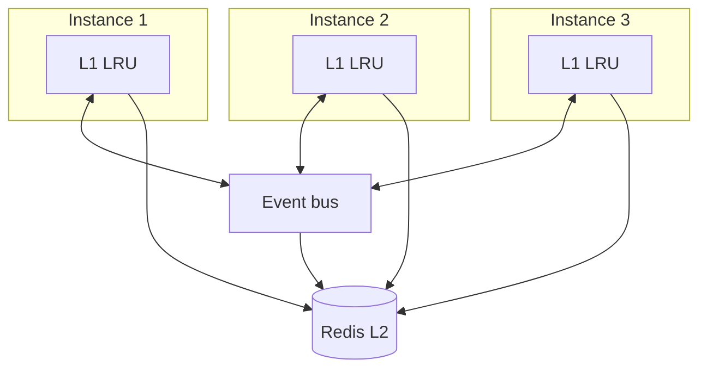

This page follows one service as it grows. Each step starts with something that breaks, then adds the smallest mechanism that fixes it. If you read only one page after the quickstart, read this one.

The service is a product API. `GET /products/:id` reads from Postgres, and the read is slow enough to matter.

## Step 1: cache in the process

```ts
import { LazyLayersCache } from 'lazy-layers-cache';

const cache = new LazyLayersCache({ ttlMs: 5 * 60_000 });

app.get('/products/:id', async (req, res) => {
  const product = await cache.getOrSet(
    `product:${req.params.id}`,
    () => db.products.findById(req.params.id),
  );
  res.json(product);
});
```

Reads that hit the cache never leave the process. Postgres sees one query per key per five minutes.

**What breaks:** you deploy a second instance. Now Postgres sees one query per key per five minutes *per instance*, and a restart empties the cache completely.

## Step 2: add a shared L2

`RedisStore` gives every instance a common tier behind their private one.

```ts
import Redis from 'ioredis';
import { LazyLayersCache, RedisStore } from 'lazy-layers-cache';

const redis = new Redis(process.env.REDIS_URL);

const cache = new LazyLayersCache({
  l2: new RedisStore(redis, { prefix: 'products:' }),
  ttlMs: 5 * 60_000,
});
```

Reads now check L1, then L2. When L2 answers, the value is written into L1 on the way back, so the next read on that instance stays in memory. Restarts no longer begin cold either, because L2 outlives the process.

Values are encoded with MessagePack on the way into Redis. You do not configure that. It is the default wire format, and [serialization](/docs/concepts/serialization) explains how it is chosen.

**What breaks:** Redis has a bad afternoon. Every request that misses L1 now waits on a connection that is not answering.

## Step 3: survive a sick L2

L2 failures are treated as misses rather than errors, so this already degrades rather than throwing. What you add here is the circuit breaker, so you stop queueing work against a store that cannot answer.

```ts
const cache = new LazyLayersCache({
  l2: new RedisStore(redis, { prefix: 'products:' }),
  ttlMs: 5 * 60_000,
  resilience: {
    l2CircuitBreaker: { failureThreshold: 5, cooldownMs: 10_000 },
  },
});
```

After five consecutive L2 failures the breaker opens and L2 calls are skipped for ten seconds. Requests fall through to L1 and then the loader. You can watch this happen through the `l2:error` and `l2:skipped` events.

**What breaks:** a popular product expires. Two hundred concurrent requests miss both layers at once and all of them call Postgres.

## Step 4: collapse the stampede

Nothing to add. Concurrent callers for one key already share a single in-flight promise, so the loader runs once.

What you can add is protection *across* instances. Four servers each collapse their own callers to one loader call, which is still four queries. A Redis-backed lock makes it one:

```ts
const cache = new LazyLayersCache({
  l2: new RedisStore(redis, { prefix: 'products:' }),
  ttlMs: 5 * 60_000,
  distributedLock: { enabled: true, waitTimeoutMs: 2_000 },
});
```

The instance that acquires the lock runs the loader. The others poll for the value and pick it up when it lands. If the lock cannot be acquired within `waitTimeoutMs`, the waiting instance runs the loader itself rather than failing the request.

**What breaks:** someone edits a product. You call `cache.delete()`, but only the instance that handled the write forgets it. The other three keep serving the old product for up to five minutes.

## Step 5: tell the other instances

This is the step that makes it a distributed cache rather than three independent caches.

```ts
import { LazyLayersCache, RedisStore, RedisEventBus } from 'lazy-layers-cache';

const bus = new RedisEventBus(redis, 'products:invalidate');
await bus.connect();

const cache = new LazyLayersCache({
  l2: new RedisStore(redis, { prefix: 'products:' }),
  eventBus: bus,
  source: process.env.INSTANCE_ID,
  ttlMs: 5 * 60_000,
});
```

Now `cache.delete('product:42')` publishes a `del` event and every peer drops that key. The staleness window goes from your TTL to one network hop.

`source` matters. Every event is stamped with it, and an instance ignores events carrying its own source so it does not re-apply its own work. Give each instance a stable, distinct value.

There is a second effect that is easy to miss. When a `getOrSet` loader returns, the value itself is broadcast, so peers put it straight into their L1 without running the loader. One instance pays for the load and the rest get it free. Set `broadcastSet: false` if you want delete-only behaviour.

**What breaks:** an instance is redeployed. While it was down it missed the invalidations, and Redis Pub/Sub does not hold messages for absent subscribers.

## Step 6: choose a delivery guarantee

Redis Pub/Sub is at-most-once. If that is not acceptable, swap the transport. The cache configuration does not change.

```ts
import { NatsEventBus } from 'lazy-layers-cache';

const bus = new NatsEventBus({
  mode: 'jetstream',
  subject: 'products.invalidate',
  jetstream: { durableName: process.env.INSTANCE_ID },
});
await bus.connect();
```

JetStream keeps a durable consumer per instance, so events that arrived while an instance was down are delivered when it reconnects. [Choosing an event bus](/docs/guides/event-buses) compares all four transports.

## Where you ended up



Each instance reads from memory first, falls back to a shared Redis tier, and hears about every change the others make. Each mechanism was added because the previous arrangement failed in a specific way, which is the order most services meet these problems in.

## Next steps

<Columns cols={2}>
  <Card title="Failure handling" icon="shield" href="/docs/guides/failure-handling">
    Stale fallback, negative caching and loader timeouts.
  </Card>
  <Card title="Event ordering" icon="list-ordered" href="/docs/architecture/event-ordering">
    How a late event is stopped from resurrecting deleted data.
  </Card>
</Columns>
