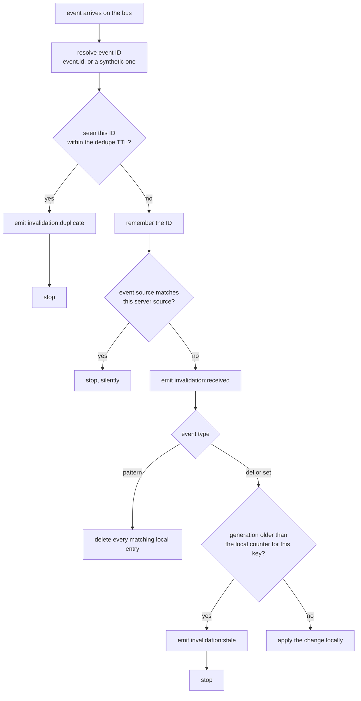

A message bus is not a promise of correctness. It is a promise of best effort, and best effort includes delivering the same event twice, delivering events in an order nobody sent them in, and handing you back the message you just published.

Apply every event you receive, in the order you receive it, and you will eventually write back a value somebody deleted. That is not a rare failure. It is the normal behaviour of a durable transport under retry.

Three checks run on every inbound event, in a fixed order. Each one catches a different failure, and none of them catches the others.

## The order the checks run in



Two things about that order are worth noticing before the sections that explain each box.

Dedupe runs **before** the source filter, so a server's own event consumes a slot in its dedupe memory on the way past. And the source filter emits nothing at all. A server dropping its own broadcast is silent by design, because on a fanout bus it happens to every event you publish and an event per event would be noise, not signal.

## 1. Deduplicate by event ID

**Protects against:** the same event being applied twice.

Every event published by the cache carries an `id`. Each server keeps the IDs it has recently applied in a map, and an event whose ID is already in that map is discarded with `invalidation:duplicate` instead of being applied again.

This is what makes a durable transport usable. RabbitMQ and NATS JetStream redeliver by design, on a lost ack, a slow consumer, or a reconnect. Without dedupe, a `set` redelivered three times does the work three times, and the redelivery that arrives after your own newer write is the one that hurts.

An event arriving without an `id`, from an older peer, gets a synthetic one built from its source, timestamp, type and keys, so it still deduplicates.

The memory is bounded on both axes:

| Option | Default | What it bounds |
| --- | --- | --- |
| `eventDedupeMaxEntries` | `10_000` | How many recent IDs are remembered. Past the cap, the oldest is evicted |
| `eventDedupeTtlMs` | `300_000` (5 minutes) | How long an ID counts as recent. Expiry is checked on lookup |

Set the TTL comfortably above your worst case redelivery window. On JetStream that window is roughly `ackWaitMs` multiplied by `maxDeliver`, so five minutes covers a five second ack wait and three delivery attempts with a very wide margin. An event redelivered after its ID has been forgotten is applied a second time, which the generation check below then has to catch on its own.

<Note>
  Applying a `del` twice is harmless. Applying a `set` twice is merely wasteful, unless a newer delete happened in between, which is exactly the case check three exists for.
</Note>

## 2. Filter your own events

**Protects against:** a server undoing its own work.

Every event carries the `source` of the server that published it. On a fanout bus, that server is also a subscriber, so its own event comes straight back to it. Applying it would mean re-running a change it already applied locally, and re-running a `del` is not a no-op: it would drop a value that a concurrent read has since re-cached.

So `event.source === this.source` returns early, before anything is dispatched.

<Warning>
  `source` has to be unique per server, and that includes per cluster worker. Two processes sharing one `source` value each ignore the other's events, believing them to be their own, and the bus appears to do nothing at all. There is no error and no warning. It is a silent correctness bug that looks exactly like a working system with a low invalidation rate.
</Warning>

Leave `source` unset and a random identifier is generated per process. That is correct, and it tells you nothing when you are reading logs at 3am. Set it to the pod name or instance ID.

## 3. Compare per-key generations

**Protects against:** a late event describing a world that has already moved on.

This is the mechanism that actually handles ordering, and the only one of the three whose absence produces a wrong answer rather than a redundant one.

Each server keeps a generation counter per key, in memory. Deleting a key advances that key's counter, and the published `del` event carries the number it advanced to. A `set` event carries the generation the value was loaded at, and does not advance anything.

When an inbound `del` or `set` carries a generation **strictly lower** than the receiver's own counter for that key, the receiver drops it and emits `invalidation:stale` carrying both numbers.

```mermaid title="sequenceDiagram"
    participant A as Server A
    participant Bus as Event bus
    participant B as Server B
    A->>A: loader resolves user:42 at generation 0
    A->>Bus: set user:42, generation 0
    B->>B: delete user:42, local counter becomes 1
    B->>Bus: del user:42, generation 1
    Bus-->>B: set user:42, generation 0 arrives late
    B->>B: 0 is lower than 1, dropped as stale
```

Without the counter, that late `set` writes a deleted user back into B's L1, where it sits until its TTL expires. With it, the delete wins whichever order the messages land in.

The counter advances in three places, and the rules differ:

| Event | How the local counter moves |
| --- | --- |
| A local `delete` | Incremented by one, then the new value is published |
| A remote `del` that is applied | Raised to the maximum of the local value and the incoming one |
| A remote `set` that is applied | Raised to the maximum of the local value and the incoming one |

Taking the maximum rather than incrementing is what keeps servers converging instead of racing each other upward.

Turning on `versioning` goes one step further and folds the generation into the storage key itself, so `user:42` becomes `user:42::v3`. An old value is then not merely ignored, it is not addressable.

## What is not guaranteed

<Warning>
  These three checks make invalidation safe against duplication, self-delivery and reordering. They do not make the cache linearizable, and nothing on this page is a consensus protocol.
</Warning>

Read this section as the list of things you have to design around.

**Equal generations are applied, not dropped.** The comparison is strictly less than. Two servers writing the same key at the same generation both win in turn, and the last event to arrive is what each peer ends up holding. The counter guards against older events. It does not impose a total order.

**Generations are per key.** There is no global sequence number, so two different keys can be applied in either order on different servers. If two keys have to change together, a cache cannot give you that.

**Counters live in memory, per process.** A restart resets every counter to zero, and the server relearns them from the events it then receives. In the window before it does, it accepts events it would previously have rejected.

**`pattern` events carry no generation at all.** They apply whenever they arrive, with no ordering protection whatsoever. One more reason to keep patterns narrow and to prefer `delete` on a known key.

**Redelivery outside the dedupe window is applied again.** The dedupe memory is bounded by both a cap and a TTL, so a message held for longer than either bound is new as far as the receiver is concerned.

**Delivery is not guaranteed on at-most-once transports.** A server that was disconnected when a `del` went past on Redis Pub/Sub or NATS Core never learns about it. Its TTL is what saves you, which is the real reason a short L1 TTL is worth paying for even with a bus attached.

**A remote `set` writes L1 only.** A peer applying a broadcast value does not write it to L2. The shared copy comes from the publisher's own write, so if that write failed open, peers hold a value L2 does not have.

**There is a propagation window.** Between a local write and its event arriving, every peer serves the old value. The window is one network hop rather than a TTL, but it is not zero, and it is unbounded when the bus is degraded.

**A partitioned server drifts.** It keeps serving its own L1, correctly as far as it can tell, until it reconnects or its entries expire.

If a key must never be served stale, do not cache it. If it can tolerate a bounded window, give it a TTL short enough that the worst case is one you would accept in an incident review.

## Watching it work

Every drop emits an event, so the ordering machinery is something you can graph rather than trust.

<CodeGroup>
```js title="src/cache/metrics.js"
import { cache } from './index.js'

cache.on((event) => {
  if (event.type === 'invalidation:duplicate') {
    metrics.increment('cache.invalidation.duplicate')
  }
  if (event.type === 'invalidation:stale') {
    // Carries both numbers, so you can see how far behind the event was.
    logger.debug({
      key: event.key,
      incoming: event.generation,
      local: event.localGeneration,
    }, 'discarded stale invalidation')
    metrics.increment('cache.invalidation.stale')
  }
})
```

```ts title="src/cache/metrics.ts"
import type { CacheEvent } from 'lazy-layers-cache'
import { cache } from './index.js'

cache.on((event: CacheEvent) => {
  if (event.type === 'invalidation:duplicate') {
    metrics.increment('cache.invalidation.duplicate')
  }
  if (event.type === 'invalidation:stale') {
    // Carries both numbers, so you can see how far behind the event was.
    logger.debug({
      key: event.key,
      incoming: event.generation,
      local: event.localGeneration,
    }, 'discarded stale invalidation')
    metrics.increment('cache.invalidation.stale')
  }
})
```
</CodeGroup>

How to read the two counters:

- A steady rate of `invalidation:duplicate` on a durable transport is normal and healthy. It is the redelivery you paid for, being caught.
- A steady rate of `invalidation:duplicate` on Redis Pub/Sub is not normal, and usually means two caches share a channel and a `source`.
- A steady rate of `invalidation:stale` means events are arriving badly out of order. The cache is doing its job, and something upstream is worth understanding before it causes a problem the cache cannot absorb.
- Neither counter moving at all, on a fleet that is definitely writing, means the events are not arriving. Check `source` uniqueness first.

<Warning>
  Never label a metric with a cache key. Keys are unbounded, and one high cardinality label will take down your metrics backend before it takes down your cache.
</Warning>

## Where to next

<CardGroup cols={2}>
  <Card title="Invalidation" icon="arrows-rotate" href="/docs/concepts/invalidation">
    Why the bus exists at all, and the three event types that travel on it.
  </Card>
  <Card title="Execution paths" icon="route" href="/docs/architecture/execution-paths">
    Where these events are published from, and what a peer does with one on arrival.
  </Card>
  <Card title="Event buses" icon="tower-broadcast" href="/docs/guides/event-buses#delivery-semantics">
    What each transport promises a server that was offline when the event went out.
  </Card>
</CardGroup>
