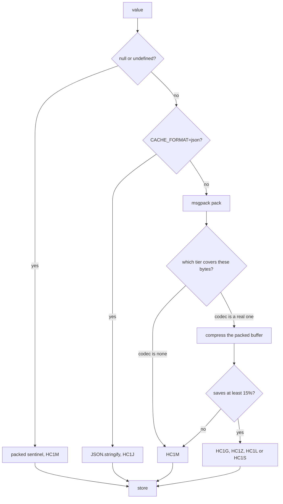

L1 holds live JavaScript objects, so nothing is encoded there. Everything that leaves the process is encoded: values written to L2, and the invalidation events that travel between servers.

Both go through the same function. `encodeInvalidationEvent` is a call to `serialize`, so a `set` event carrying a loaded value is packed exactly the way that value would be packed in Redis. That is also why `broadcastSetMaxBytes` is measured against the encoded event rather than against your object.

Every value is packed with MessagePack. What happens next depends on how large the packed buffer turned out to be, because the codec is chosen per payload from a list of size tiers. Every buffer carries a 4-byte tag naming its own format, so the reader never has to know what the writer decided.

## Why not JSON

`JSON.stringify` is native, extremely well optimised, and readable in `redis-cli`. It is not a bad format. It is a format that spends bytes describing a shape you already know.

Take the session fixture the benchmarks use, the smallest and hottest shape in most applications:

```json
{"uid":"eb3d0a1b7971473bc9882c2e","sid":"97c71aa27740355591bd1c6360deaef8","exp":1740086400000,"scopes":["read","write"],"ip":"10.243.49.222"}
```

That is 142 bytes. Here is where they go:

| Part of the document | Bytes |
| --- | --- |
| Structural punctuation (`{}[]",:`) | 34 |
| Key names, repeated on every record | 17 |
| Actual values | 91 |
| **Total** | **142** |

Fifty one bytes carry no information. They are there because JSON is a text format that has to re-explain the record's structure to every reader, on every record, forever. Multiply that by every session in a cache holding several million of them.

MessagePack encodes the same record in 119 bytes, and LazyLayers stores 123 of them once the 4-byte tag is on the front. Lengths become length bytes instead of quotes and commas. Numbers become numbers instead of decimal digits. Nothing about your data changed.

<Note>
  The benchmark headline compares what actually lands in Redis, which for the comparison target is JSON plus the entry envelope wrapped around it. On that basis the session record is 212 bytes against 123. The 142 bytes above is the record on its own, with no envelope, so you can see where JSON's overhead comes from rather than just how large the total is.
</Note>

## The three encodings

Three things can happen to a value: it is packed with MessagePack and stored, it is packed and then compressed, or it is written as debug JSON. The compressed case has four codecs behind it, each with its own tag, which is what makes the read path able to accept a format the writer picked without any coordination.

| Prefix | Encoding | Written when |
| --- | --- | --- |
| `HC1M` | MessagePack | The tier for this size says `none`, or compression did not save enough |
| `HC1G` | gzip over MessagePack | The tier says `gzip` and it saved at least 15% |
| `HC1Z` | zstd over MessagePack | The tier says `zstd` and it saved at least 15% |
| `HC1L` | lz4 over MessagePack | The tier says `lz4` and it saved at least 15% |
| `HC1S` | snappy over MessagePack | The tier says `snappy` and it saved at least 15% |
| `HC1J` | JSON | `CACHE_FORMAT=json`, or `CACHE_DEBUG_SERIALIZATION=true` |

Sizes are always compared against the **MessagePack** buffer, not against your object and not against its JSON form. A payload that JSON would render at 90 KB but MessagePack packs to 40 KB is placed in the tier that covers 40 KB.



The 15% check is the part that earns its place, and it applies to every codec equally. Already compressed images, encrypted blobs and high entropy identifiers do not compress. Without the check you would pay the CPU and store a buffer that is the same size or larger. With it, the compressed result is measured and thrown away when it does not clear the bar, and the plain MessagePack buffer is stored instead.

<Warning>
  Throwing it away still costs you the compression. Any payload that lands in a tier naming a real codec is compressed at least once per write, even when the result is discarded. If you cache large incompressible values, that is real CPU spent for nothing, and the lever is to put those sizes in a `none` tier or to stop caching them.
</Warning>

`null` and `undefined` both encode to a packed sentinel string under `HC1M`, 25 bytes in total, and decode back to `null`. That is what keeps a deliberately cached `null` distinguishable from an absent key: `RedisStore.get` returns `undefined` before decoding anything when Redis has no key at all.

## Compression makes small values bigger

This is the fact the tier list exists for. Here is every codec run against the packed 119 byte session token.

| Codec | Stored bytes | Result |
| --- | --- | --- |
| `none` | 119 | baseline |
| `snappy` | 122 | 2.5% larger |
| `lz4` | 125 | 5.0% larger |
| `zstd` | 128 | 7.6% larger |
| `gzip` | 140 | 17.6% larger |

Every one of them loses. A compressed stream carries a header and a frame, and below roughly a kilobyte that framing is most of what you stored. The 15% rule means none of these would actually be written, so the cost is wasted CPU rather than wasted bytes, but the right answer is to not attempt it. That is the first tier in every list shipped here.

## Choosing a codec

Above a kilobyte the codecs separate, and they separate differently at 14 KB than they do at 100 KB. These are the same seeded fixtures the rest of the benchmarks use, packed with MessagePack, on Node 24 and Apple Silicon.

Each cell is stored bytes, then the fraction saved against the packed buffer, then compression time.

| Codec | API list (14,136 B) | Metrics (100,452 B) | Product catalogue (113,541 B) |
| --- | --- | --- | --- |
| `snappy` | 4,913 / 65.2% / 9.2 us | 47,312 / 52.9% / 87 us | 17,722 / 84.4% / 24.5 us |
| `lz4` | 4,783 / 66.2% / 6.5 us | 47,028 / 53.2% / 87 us | 14,598 / 87.1% / 24.5 us |
| `zstd` | 3,512 / 75.2% / 20.8 us | 31,100 / 69.0% / 151 us | 10,011 / 91.2% / 47 us |
| `gzip` | 3,513 / 75.1% / 49.2 us | 30,389 / 69.7% / 1,007 us | 9,899 / 91.3% / 296 us |

Two things fall out of that grid.

**zstd is gzip's ratio without gzip's bill.** The two are within a single percentage point of each other on all three fixtures, and zstd gets there in a fraction of the time: 2.4 times faster on the 14 KB list, and around 6.5 times faster on the two large ones. On the metrics fixture gzip spends over a millisecond of CPU per write to save 711 bytes more than zstd did in 151 microseconds.

**lz4 and snappy buy speed with storage.** They are roughly two to three times faster than zstd, and the bytes they leave behind are real. Switching the metrics fixture from lz4 to zstd removes another 34% of what lz4 stored, and on the catalogue zstd removes 43% of what snappy stored. Across all three fixtures that gap runs from 27% to 45%. If Redis memory is what you are paying for, that is the wrong trade. If a write path is CPU bound and the values are short lived, it is the right one.

That gives a short decision rule.

| You care most about | Use | Why |
| --- | --- | --- |
| Every server can read it, today | `gzip` | The default. Understood by every release that has ever shipped |
| Redis memory | `zstd` | gzip's ratio, six times less CPU on large values |
| Write latency on hot, large values | `lz4` or `snappy` | Two to three times faster than zstd, and zstd would have removed another 27% to 45% of what they store |
| Payloads under about a kilobyte | `none` | Every codec makes them larger |

<Note>
  Byte counts are deterministic. The fixtures are seeded, so the same sizes reproduce on any machine. Times are medians on one machine and move with your CPU, Node version and thermal state, so compare the ratios between codecs rather than the absolute microseconds.
</Note>

## Size tiers

A tier list is an ascending set of size bands, each naming the codec to use for payloads in that band. `configureCompression` installs one.

<CodeGroup>
```js title="src/cache/compression.js"
import { configureCompression } from 'lazy-layers-cache'

// Small values are left alone, mid-sized values take the fast codec, and
// anything large enough to be worth real CPU gets the dense one.
configureCompression([
  { maxBytes: 1024, codec: 'none' },
  { maxBytes: 262144, codec: 'lz4' },
  { codec: 'zstd' },
])
```

```ts title="src/cache/compression.ts"
import { configureCompression } from 'lazy-layers-cache'

// Small values are left alone, mid-sized values take the fast codec, and
// anything large enough to be worth real CPU gets the dense one.
configureCompression([
  { maxBytes: 1024, codec: 'none' },
  { maxBytes: 262144, codec: 'lz4' },
  { codec: 'zstd' },
])
```
</CodeGroup>

Import that file once, before you construct the cache. The tier list is process-wide rather than per cache instance, so the last call wins for everything in the process.

Four rules govern the list, and the first three are checked when you call `configureCompression` rather than when a value is written.

- `maxBytes` is an exclusive upper bound. A tier of `{ maxBytes: 1024, codec: 'none' }` covers everything under 1,024 bytes, and 1,024 itself belongs to the next tier.
- Bounds must ascend. A tier whose `maxBytes` is not greater than the previous tier's throws.
- Only the **last** tier may omit `maxBytes`, and omitting it there means "and above". Anywhere else it throws.
- An unknown codec name throws. A known codec that this process cannot run falls back to `gzip` at write time, which is covered below.

<Warning>
  If the last tier keeps its `maxBytes`, anything larger than that bound falls off the end of the list and is stored raw. That is a legitimate way to say "do not compress beyond this size", but it is not what most people mean, so leave `maxBytes` off the tier you want to catch everything.
</Warning>

Three shorthands cover the common cases without writing a list.

| Argument | Expands to |
| --- | --- |
| `'gzip'` | `none` under 1 KB, then `gzip`. This is the default |
| `'zstd'` | `none` under 1 KB, then `zstd` |
| `'auto'` | `none` under 1 KB, the fastest installed codec up to 256 KB, then the densest installed codec |

`'auto'` resolves against what the machine actually has. The upper band is `zstd` when this Node build has it and `gzip` otherwise. The middle band is `lz4`, or `snappy` when `lz4` is missing, or the same codec as the upper band when neither native module is installed.

`getCompressionTiers` returns the list currently in effect, which is the honest way to answer "what is this server doing" rather than reading the configuration you think you shipped.

<CodeGroup>
```js title="src/cache/compression.js"
import { getCompressionTiers, LZ4_AVAILABLE, SNAPPY_AVAILABLE, ZSTD_AVAILABLE } from 'lazy-layers-cache'

logger.info({
  tiers: getCompressionTiers(),
  zstd: ZSTD_AVAILABLE,   // boolean, decided at import
  lz4: LZ4_AVAILABLE(),   // function, resolves the native module on first call
  snappy: SNAPPY_AVAILABLE(),
}, 'compression profile')
```

```ts title="src/cache/compression.ts"
import { getCompressionTiers, LZ4_AVAILABLE, SNAPPY_AVAILABLE, ZSTD_AVAILABLE } from 'lazy-layers-cache'

logger.info({
  tiers: getCompressionTiers(),
  zstd: ZSTD_AVAILABLE,   // boolean, decided at import
  lz4: LZ4_AVAILABLE(),   // function, resolves the native module on first call
  snappy: SNAPPY_AVAILABLE(),
}, 'compression profile')
```
</CodeGroup>

`ZSTD_AVAILABLE` is a boolean because the answer is fixed the moment `node:zlib` is loaded. `LZ4_AVAILABLE` and `SNAPPY_AVAILABLE` are functions because they resolve an optional native module on first call and cache the result.

## Which codecs this process can actually run

Two of the four are not guaranteed to exist, and the library treats that as normal rather than as an error.

**zstd comes from `node:zlib`**, where it landed in Node 22.15 and 23.8. This package supports Node 20, so the presence of `zstdCompressSync` is checked at runtime rather than assumed. On an older runtime `ZSTD_AVAILABLE` is `false`.

**lz4 and snappy are `optionalDependencies`**, `lz4-napi` and `snappy`. They are native modules, so they need a prebuilt binary or a toolchain, and a machine that has neither installs the package cleanly without them. They are resolved lazily, once, and stay unavailable if the resolution failed.

A tier that names a codec this process cannot run does not throw and does not store the value raw. It falls back to `gzip`, which every Node build has. That is what lets one tier list ship to a fleet where some machines have the native modules and some do not.

<Note>
  Fallback is per process, so the same configuration can produce `HC1L` on one server and `HC1G` on another for the same key. Reads do not care. Both tags decode everywhere, which is the point of tagging the buffer.
</Note>

## The default is gzip on purpose

The shipped tiers are `none` under 1,024 bytes and `gzip` above it. gzip is not the fastest codec on that table and it is not the densest. It is the one every release of this library has been able to read.

That matters during a deploy, because two versions of your code read the same Redis at the same time. A server on an older build that meets an `HC1Z` buffer does not know the tag. It decodes to `null`, which becomes a cache miss and runs the loader, so the request succeeds, but you have quietly turned part of your cache off for the length of the rollout.

So the order is fixed. Upgrade the whole fleet to a build that understands the new tags first. Then change the tier list. Reads accept every format at all times, which is what makes the second step safe and reversible, but only once the first step is finished everywhere.

The lower bound moved for the same reason it is safe to move it. The old rule refused to compress anything under 64 KB, which meant the 14 KB API list was stored raw at 14,136 bytes when gzip would have put it away in 3,513. Nothing about the format changed to fix that. Only the tier boundary did.

## The prefix is what makes a rolling deploy safe

The reason each buffer names its own format is not tidiness. It is that the reader never assumes. It compares four bytes and dispatches to the matching decoder. A value written by an old server decodes on a new one and the other way round, and there is no migration, no dual-write window and no version field to keep in sync.

Four cases fall out of that, all verified against the decoder:

- A buffer with no recognised prefix is treated as legacy. Raw MessagePack written before prefixes existed decodes normally, and so does a bare JSON string.
- A tag in the `HC1` family that the reader does not know decodes to `null`, which becomes a cache miss and runs your loader. This is checked before the legacy path so that an unknown future encoding degrades to a slow read instead of letting MessagePack read the tag bytes as data and return a plausible wrong value.
- A tag the reader knows but cannot run, such as `HC1L` on a server without `lz4-napi`, also decodes to `null`. Missing an optional native module costs you a miss, not a crash.
- Reading is entirely independent of the write policy, so the tier list can differ per environment, or per server mid-rollout, without anything breaking.

That last property is the whole reason adding four new tags was possible at all.

## Corruption is not an exception

A truncated buffer, a damaged compressed stream and a half-written value all return `null` rather than throwing.

That is deliberate, and it is the same stance as everything else in [resilience](/docs/concepts/resilience#fail-open). A damaged cache entry becomes a miss, your loader runs, the request completes. It does not become a 500 for a value that was only ever an optimisation.

## What the trade actually is against JSON

Smaller payloads cost CPU. This is the honest shape of it, measured against `JSON.stringify` including the entry envelope the comparison library stores, with the default tiers in effect.

| Fixture | JSON bytes | LazyLayers bytes | Saved | Encoding | Serialize speed | Deserialize speed |
| --- | --- | --- | --- | --- | --- | --- |
| Session token | 212 | 123 | 42.0% | `msgpack` | 0.52x | 0.99x |
| User profile | 424 | 284 | 33.0% | `msgpack` | 0.69x | 0.75x |
| API list, 50 records | 18,127 | 3,517 | 80.6% | `msgpack-gzip` | not re-measured | not re-measured |
| Metrics, 1,440 points | 119,155 | 30,393 | 74.5% | `msgpack-gzip` | 0.21x | 0.61x |
| Product catalogue, 400 records | 125,568 | 9,903 | 92.1% | `msgpack-gzip` | 0.23x | 0.60x |

Speeds below 1.0x mean slower than `JSON.stringify`. The API list row has no ratio because it changed encoding when the floor moved: it used to be stored raw and is now gzipped, so the throughput figure from the old run no longer describes it. Its byte count is deterministic and does hold.

That trade is good when bytes are the metered resource. Managed Redis is sold by memory, cross-zone network transfer is billed, and replication multiplies both. It is a worse trade for a tiny key serialized millions of times a second on a CPU that is already your bottleneck, where JSON's raw speed wins and the handful of bytes you saved buy nothing.

The catalogue row is where the shape becomes obvious. It packs to 113,541 bytes of MessagePack and stores 9,903 after gzip, a saving of 91.3% on top of what MessagePack already did. That is 400 records sharing one boilerplate description, which is exactly the repetition a dictionary coder exists for.

## Inspecting what a value costs

`serializeWithStats` returns the buffer alongside what happened to it, which is how you answer "is this key worth caching" with a number rather than an opinion.

<CodeGroup>
```js title="src/catalog/repository.js"
import { serializeWithStats } from 'lazy-layers-cache'
import { cache } from '../cache/index.js'
import { db } from '../db.js'

export async function getCatalog() {
  return cache.getOrSet('catalog:v1', async ({ signal } = {}) => {
    const catalog = await db.products.list({ signal })

    // Measure what this value will cost on the wire before it goes anywhere.
    const stats = serializeWithStats(catalog)
    logger.info({
      encoding: stats.encoding,         // 'msgpack-gzip'
      packedBytes: stats.originalBytes, // 113541
      storedBytes: stats.storedBytes,   // 9903
      saved: stats.compressionRatio,    // 0.9128, savings over the packed buffer
    }, 'catalog encoded')

    return catalog
  })
}
```

```ts title="src/catalog/repository.ts"
import { serializeWithStats } from 'lazy-layers-cache'
import type { Catalog } from '../types/catalog.js'
import { cache } from '../cache/index.js'
import { db } from '../db.js'

export async function getCatalog(): Promise<Catalog | undefined> {
  return cache.getOrSet('catalog:v1', async ({ signal } = {}) => {
    const catalog = await db.products.list({ signal })

    // Measure what this value will cost on the wire before it goes anywhere.
    const stats = serializeWithStats(catalog)
    logger.info({
      encoding: stats.encoding,         // 'msgpack-gzip'
      packedBytes: stats.originalBytes, // 113541
      storedBytes: stats.storedBytes,   // 9903
      saved: stats.compressionRatio,    // 0.9128, savings over the packed buffer
    }, 'catalog encoded')

    return catalog
  })
}
```
</CodeGroup>

`encoding` names the codec that won, so it is one of `msgpack`, `msgpack-gzip`, `msgpack-zstd`, `msgpack-lz4`, `msgpack-snappy` or `json`. `compressionRatio` is the fraction saved relative to the MessagePack buffer, so it is `0` on anything stored as plain `msgpack`. `originalBytes` is the packed size and `storedBytes` includes the 4-byte prefix.

Run it against your real values before you pick a tier list. The fixtures on this page are representative shapes, not your shapes, and the only number that decides the boundary between two tiers is what your own payloads pack to.

The [observability dashboard](/docs/guides/observability) shows the encoding and the stored size per key, which is the same question asked across your whole keyspace instead of one value at a time.

<Note>
  Encoded size is also what decides whether a peer gets primed. `broadcastSetMaxBytes` is compared against the encoded `set` event, so this is the number to pick that ceiling from, and it moves when you change the tier list.
</Note>

## Storing readable JSON instead

Set `CACHE_FORMAT=json` and writes become `HC1J`, which is `JSON.stringify` with a tag on the front. `CACHE_DEBUG_SERIALIZATION=true` does the same thing.

Values are then readable with `redis-cli`, at the cost of every byte the rest of this page was about. The check happens before packing, so it bypasses the tier list entirely and nothing is compressed while it is on. Because the read path dispatches on the prefix, you can turn it on in one environment, or on one server, and every existing binary value keeps decoding.

Use it to debug an encoding question in staging. It is not a production setting.

## Where to next

<CardGroup cols={2}>
  <Card title="Environment variables" icon="sliders" href="/docs/reference/environment-variables#serialization">
    `CACHE_COMPRESSION`, the exact strings it accepts, and what a malformed value does.
  </Card>
  <Card title="Production checklist" icon="clipboard-check" href="/docs/setups/production#choosing-a-compression-profile">
    Which profile to run on a real fleet, and the order the rollout has to happen in.
  </Card>
  <Card title="Lazy loading" icon="bolt" href="/docs/concepts/lazy-loading#the-lazy-fan-out">
    The fan-out that sends an encoded value to every server, and the ceiling you put on it.
  </Card>
</CardGroup>
