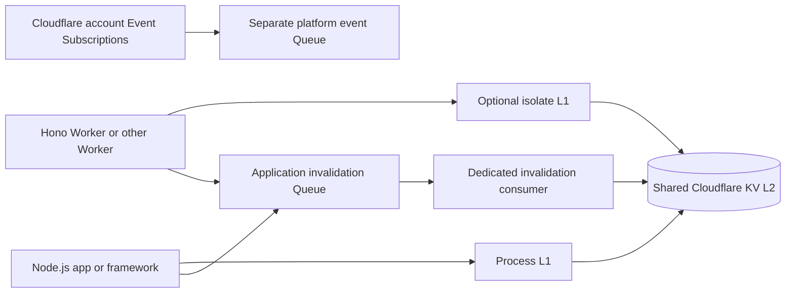

Cloudflare KV is a shared L2 for read-heavy data. You can access the same KV record format from a Cloudflare Worker binding or from a Node.js service through Cloudflare's REST API. Both paths support `getOrSet`, `set`, `invalidate`, and `invalidateByPattern`.

<Warning>
  KV is eventually consistent. A write, deletion, or listing can remain stale in another location for 60 seconds or more. Use this setup for cacheable data whose freshness budget permits that delay. KV cannot provide Redis-style atomic leases, transaction coordination, or immediate cross-instance invalidation.
</Warning>

## Choose a runtime

| Runtime | Import | KV connection | Cache API |
| --- | --- | --- | --- |
| Cloudflare Workers, including Hono | `lazy-layers-cache/cloudflare` | `env.CACHE` binding | `CloudflareWorkerCache` |
| Node.js, including Hono on Node | `lazy-layers-cache` | `CloudflareKVRestNamespace` | `setupCache` / `LazyLayersCache` |

The Workers entrypoint is small enough to bundle without the package's Node-only compression and Redis dependencies. The Node entrypoint retains the full cache features and accepts Cloudflare KV as its L2.

## System design



On a read, `getOrSet` checks L1, then KV, then your read-only loader. The Worker entrypoint keeps in-flight dedupe within the request-scoped cache object. The Node.js cache adds its existing bounded origin gate, failure handling, and optional Redis or other event bus. Both KV stores use an `LLK1` expiry envelope around a MessagePack HC1 value. `setupCache({ kv })` selects the interoperable MessagePack and gzip L2 codec by default. Worker and Node.js readers can share records when they use the **same KV namespace and key prefix**.

After an authoritative write commits, `invalidate` or `invalidateByPattern` removes the caller's L1 entry and deletes matching KV entries. With `invalidationPublisher` configured, the call also enqueues an application invalidation. A separate Queue consumer repeats the KV deletion, retries transient failures, and sends exhausted messages to a dead-letter queue. Queue publication failure reaches the caller, so the write path can record and retry it.

| Problem | Design choice | Remaining limit |
| --- | --- | --- |
| Native Node dependencies cannot run in a Worker | Small `lazy-layers-cache/cloudflare` entrypoint with the portable HC1 MessagePack/gzip subset | Node-only LZ4, Zstd, and Snappy tags are not readable in Workers |
| KV physical expiry has a 60-second minimum | Logical expiry in the value header | Expired bytes can remain until physical expiry |
| Large values consume KV storage | Existing HC1 serializer with adaptive gzip shared by Worker and Node readers | Compression spends CPU and does not reduce per-key operation charges |
| Many callers miss the same key | Local in-flight dedupe | KV has no cross-instance atomic lease |
| Delete a key family | Prefix-filtered, paginated `deleteByPattern` | KV listing is eventually consistent and Worker scans are bounded |
| Invalidations need retry | Application Queue and dedicated consumer | Queue messages go to a consumer, not every isolate's L1 |
| Observe Cloudflare builds and namespace lifecycle | Separate Event Subscriptions consumer | Those events contain no cache key changes |

The Queue is a durable invalidation pipeline, **not a pub/sub fan-out to all L1 caches**. Each Worker isolate's L1 ages out by its configured TTL. KV may continue serving an old value from another location during propagation. Use an authoritative read path when a request requires strict read-after-write behavior. For Node.js peers that need prompt L1 fan-out, configure an actual Redis, RabbitMQ, or NATS event bus separately.

## Cloudflare Workers with Hono

The [runnable Hono Worker](https://github.com/Amon20044/LazyLayers/tree/main/examples/cloudflare-kv-hono) binds `CACHE` and an `INVALIDATIONS` Queue producer in `wrangler.jsonc`. Set `ORIGIN_BASE_URL` to your real read-only origin. Use the same KV namespace ID in this Worker and the consumer.

<CodeGroup>
```js title="worker.js"
import { Hono } from 'hono'
import { CloudflareWorkerCache, CloudflareWorkerMemoryStore, CloudflareQueueInvalidationPublisher } from 'lazy-layers-cache/cloudflare'

const app = new Hono()
const l1 = new CloudflareWorkerMemoryStore(1000)

app.get('/users/:id', async (c) => {
  const cache = new CloudflareWorkerCache(c.env.CACHE, {
    prefix: 'users-api:', ttlMs: 5 * 60_000, l1, compression: 'auto',
    invalidationPublisher: new CloudflareQueueInvalidationPublisher(c.env.INVALIDATIONS, 'users-api'),
  })
  const id = c.req.param('id')
  const user = await cache.getOrSet(`user:${encodeURIComponent(id).replace(/\*/g, '%2A')}`, async () => {
    const response = await fetch(new URL(`/users/${encodeURIComponent(id)}`, c.env.ORIGIN_BASE_URL))
    if (response.status === 404) return undefined
    if (!response.ok) throw new Error(`Origin returned HTTP ${response.status}`)
    return response.json()
  })
  return user === undefined ? c.notFound() : c.json(user)
})

export default app
```

```ts title="worker.ts"
import { Hono } from 'hono'
import {
  CloudflareWorkerCache,
  CloudflareWorkerMemoryStore,
  CloudflareQueueInvalidationPublisher,
  type CloudflareKVNamespace,
  type CloudflareQueueSender,
} from 'lazy-layers-cache/cloudflare'

type Env = { CACHE: CloudflareKVNamespace; INVALIDATIONS: CloudflareQueueSender; ORIGIN_BASE_URL: string }
type User = { id: string; name: string }
const app = new Hono<{ Bindings: Env }>()
const l1 = new CloudflareWorkerMemoryStore<User>(1000)

app.get('/users/:id', async (c) => {
  const cache = new CloudflareWorkerCache<User>(c.env.CACHE, {
    prefix: 'users-api:', ttlMs: 5 * 60_000, l1, compression: 'auto',
    invalidationPublisher: new CloudflareQueueInvalidationPublisher(c.env.INVALIDATIONS, 'users-api'),
  })
  const id = c.req.param('id')
  const user = await cache.getOrSet(`user:${encodeURIComponent(id).replace(/\*/g, '%2A')}`, async () => {
    const response = await fetch(new URL(`/users/${encodeURIComponent(id)}`, c.env.ORIGIN_BASE_URL))
    if (response.status === 404) return undefined
    if (!response.ok) throw new Error(`Origin returned HTTP ${response.status}`)
    return response.json() as Promise<User>
  })
  return user === undefined ? c.notFound() : c.json(user)
})

export default app
```
</CodeGroup>

Create the cache inside the request so the KV and Queue bindings belong to that request. The optional `CloudflareWorkerMemoryStore` retains cloned values **only while the same isolate is reused**. It is an opportunistic, bounded hot cache; Cloudflare can evict the isolate at any time, and later requests can land on another isolate with an empty L1. Share one L1 only among caches that use the same KV namespace, and key authorized data by every required tenant/user scope. Keys are isolated by prefix. It has a 1,000-entry limit here. In-flight dedupe is request-scoped. Omit `l1` when this short-lived extra staleness is unacceptable; KV itself remains eventually consistent.

After an authoritative write commits, call `cache.invalidate('user:42')` or `cache.invalidateByPattern('tenant:42:user:*')`. Encode untrusted key segments before constructing a pattern so a `*` in a tenant ID cannot widen the deletion. The [runnable example](https://github.com/Amon20044/LazyLayers/blob/main/examples/cloudflare-kv-hono/worker.ts) includes this pattern.

## Node.js with Cloudflare KV

Create a Cloudflare API token with Workers KV read/write and Queues Write permissions, scoped to the account you use. Keep the token in your runtime's secret store. The REST path makes one HTTPS request per simple KV operation, so measure its latency and Cloudflare API rate limits for your workload.

<CodeGroup>
```js title="cache.js"
import { CloudflareKVRestNamespace, setupCache } from 'lazy-layers-cache'
import { CloudflareQueueInvalidationPublisher, CloudflareQueueRestSender } from 'lazy-layers-cache/cloudflare'

const kv = new CloudflareKVRestNamespace({
  accountId: process.env.CLOUDFLARE_ACCOUNT_ID,
  namespaceId: process.env.CLOUDFLARE_KV_NAMESPACE_ID,
  apiToken: process.env.CLOUDFLARE_API_TOKEN,
})

export const cache = await setupCache({
  namespace: 'users-api',
  redis: false,
  kv: { namespace: kv, store: { prefix: 'users-api:', compression: 'auto' } },
  invalidationPublisher: new CloudflareQueueInvalidationPublisher(
    new CloudflareQueueRestSender({
      accountId: process.env.CLOUDFLARE_ACCOUNT_ID,
      queueId: process.env.CLOUDFLARE_INVALIDATION_QUEUE_ID,
      apiToken: process.env.CLOUDFLARE_API_TOKEN,
    }),
    'users-api',
  ),
  levels: { L2: { ttlMs: 5 * 60_000 } },
})
```

```ts title="cache.ts"
import { CloudflareKVRestNamespace, setupCache } from 'lazy-layers-cache'
import { CloudflareQueueInvalidationPublisher, CloudflareQueueRestSender } from 'lazy-layers-cache/cloudflare'

const kv = new CloudflareKVRestNamespace({
  accountId: process.env.CLOUDFLARE_ACCOUNT_ID!,
  namespaceId: process.env.CLOUDFLARE_KV_NAMESPACE_ID!,
  apiToken: process.env.CLOUDFLARE_API_TOKEN!,
})

export const cache = await setupCache({
  namespace: 'users-api',
  redis: false,
  kv: { namespace: kv, store: { prefix: 'users-api:', compression: 'auto' } },
  invalidationPublisher: new CloudflareQueueInvalidationPublisher(
    new CloudflareQueueRestSender({
      accountId: process.env.CLOUDFLARE_ACCOUNT_ID!,
      queueId: process.env.CLOUDFLARE_INVALIDATION_QUEUE_ID!,
      apiToken: process.env.CLOUDFLARE_API_TOKEN!,
    }),
    'users-api',
  ),
  levels: { L2: { ttlMs: 5 * 60_000 } },
})
```
</CodeGroup>

`setupCache` checks that it can list the selected namespace before returning. An explicit `kv` selection does not implicitly connect to `REDIS_URL`. You can pass an explicit `redis` configuration alongside `kv` if you still use Redis Pub/Sub as the peer L1 event bus. `close()` releases cache-owned resources. The caller owns the KV client and API token.

The [runnable Node.js Hono example](https://github.com/Amon20044/LazyLayers/tree/main/examples/cloudflare-kv-node-hono) uses this setup. The same cache object works in Express, Fastify, and plain HTTP handlers. Call `getOrSet` in the read path. Call `invalidate` or `invalidateByPattern` only after the origin write commits.

## Application invalidation Queue

The [invalidation consumer](https://github.com/Amon20044/LazyLayers/tree/main/examples/cloudflare-kv-invalidation) uses `CloudflareWorkerKVStore` to apply validated key and pattern messages to KV. It is a separate Worker from the Hono producer and from the platform event consumer.

```bash
npx wrangler queues create lazy-layers-cache-invalidations
npx wrangler queues create lazy-layers-cache-invalidations-dlq
npm run cloudflare:invalidation:dry-run
npx wrangler deploy --config examples/cloudflare-kv-invalidation/wrangler.jsonc
npx wrangler deploy --config examples/cloudflare-kv-hono/wrangler.jsonc
```

Set both Workers' `CACHE` bindings to the **same existing KV namespace ID** before deployment. Otherwise Wrangler may provision two independent namespaces. The Node.js sender uses the Queue ID, while a Worker uses its Queue binding. The message scope (`users-api`) and KV prefix (`users-api:`) must match across producer, consumer, and Node.js service. The consumer rejects unknown scopes and never treats an account Event Subscription as an application invalidation.

Publish only after the authoritative write commits. Queue delivery is at least once, so repeated deletion is safe. Monitor the dead-letter queue for failed purges. An invalidation can race a concurrent cache fill and KV propagation can still expose an old copy. The Queue adds retries, not read-after-write consistency.

## Pattern deletion and KV limits

`CloudflareKVStore` and `CloudflareWorkerKVStore` implement the eight `CacheStore` methods, including `deleteByPattern`, `clear`, and `size`. Pattern deletion lists keys under the literal prefix before the first `*`, filters them with the library's wildcard matcher, and deletes matches. Use narrow patterns such as `tenant:42:user:*` to avoid scanning the whole namespace.

KV listings and deletions are eventually consistent. A concurrent writer can recreate a key, and a remote location can still serve a cached old value after deletion. The Worker store scans at most 400 keys by default before deleting any matches. `maxPatternScanKeys` can tune that limit up to 900. Use narrow patterns, a background workflow with explicit pages for large purges, or version your key prefix and let old entries expire. `size()` counts physically listed keys, including records whose shorter logical TTL has expired but whose KV retention has not.

KV requires at least 60 seconds of physical expiration. LazyLayers writes the requested expiry inside each value and treats it as a miss after that time, so a 10-second TTL works on reads even while KV retains the bytes longer. KV limits values to 25 MiB and keys to 512 bytes, and limits writes to the same key to one per second. `levels.L2.maxEntries` is unsupported and rejected. KV provides no distributed lock or atomic publication, so cold loads can run concurrently across instances. The transaction API remains Redis-only.

## Serialization and KV cost

Worker and Node KV stores call the same cache serializer. Import it from `lazy-layers-cache` on Node or from `lazy-layers-cache/cloudflare` in a Worker:

```ts
import { serializeCacheValue, deserializeCacheValue } from 'lazy-layers-cache/cloudflare'

const stored = await serializeCacheValue({ id: '42' }, 'auto')
const value = await deserializeCacheValue(stored)
```

Do not tag, gzip, or JSON-encode a cache record in an adapter. `serializeCacheValue` writes the shared HC1 policy: packed values below 1 KiB stay raw `HC1M` MessagePack. At 1 KiB or more, `compression: 'auto'` (the default) tries gzip and stores `HC1G` only when it saves at least 15%. Otherwise it keeps `HC1M`. The Worker facade uses `CompressionStream`; the Node gzip policy uses the same thresholds and tags. Both readers decode `HC1M` and `HC1G`, and Worker decompression is capped at 25 MiB. They also read earlier `HC1J` records, including a stored copy of the null sentinel string. A cached `null` is the packed sentinel inside `HC1M`. Dates and `Uint8Array` values keep their types. Node-only `HC1L`, `HC1Z`, and `HC1S` records decode as a miss on Workers. Set `compression: 'none'` for already compressed or incompressible values where the trial would waste CPU. This option changes new writes; readers continue to accept both portable formats.

Cloudflare [charges KV by stored GB-month and per-key reads, writes, deletes, and list requests](https://developers.cloudflare.com/kv/platform/pricing/). Compression can reduce stored bytes and help values fit the 25 MiB limit. It does **not** reduce the number of billed KV operations, and KV has no egress charge. L1 hits can avoid some KV reads; the gain depends on how often the same isolate or Node.js process serves a key. Pattern invalidation can add list and delete operations. Measure your own payload mix, hit rate, CPU time, and operation counts before claiming a dollar saving.

The Node cache's Redis/L1 LZ4 and Zstd savings are separate measurements. Do not apply those Redis benchmark percentages to Cloudflare KV. For a shared Worker/Node namespace, keep the default KV L2 codec or explicitly use `{ format: 'msgpack', compression: 'gzip' }` or `{ format: 'msgpack', compression: 'none' }`. Worker readers do not decode Node-only `HC1L`, `HC1Z`, or `HC1S` records. During a rolling upgrade from an older source build that understands only `HC1J`, do not start HC1 MessagePack writes until every reader has been upgraded; `compression: 'none'` still writes `HC1M`.

## Cloudflare account event subscriptions

Cloudflare [Event Subscriptions](https://developers.cloudflare.com/workers/ci-cd/builds/event-subscriptions/) deliver Workers Builds and KV namespace lifecycle events to a separate Queue. They do **not** emit key writes or deletions. Application invalidation messages come from your code through the dedicated invalidation Queue above.

The [separate event consumer](https://github.com/Amon20044/LazyLayers/tree/main/examples/cloudflare-event-subscriptions) validates those platform messages, writes structured logs, and optionally forwards a small summary to a webhook. Failed webhook deliveries retry and then reach a dead-letter queue.

```bash
npm run cloudflare:events:dry-run
npx wrangler queues create lazy-layers-platform-events
npx wrangler queues create lazy-layers-platform-events-dlq
npx wrangler deploy --config examples/cloudflare-event-subscriptions/wrangler.jsonc
npx wrangler queues subscription create lazy-layers-platform-events --source kv --events namespace.created,namespace.deleted
npx wrangler queues subscription create lazy-layers-platform-events --source workersBuilds.worker --worker-name YOUR_WORKER --events build.started,build.failed,build.canceled,build.succeeded
```

Set `PLATFORM_EVENT_WEBHOOK_URL` as a Worker secret if you want outbound notifications. Leave it unset for log-only consumption. Review the [Cloudflare subscription guide](https://developers.cloudflare.com/queues/event-subscriptions/manage-event-subscriptions/) before attaching it to an existing account.
